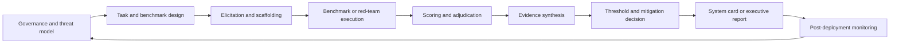
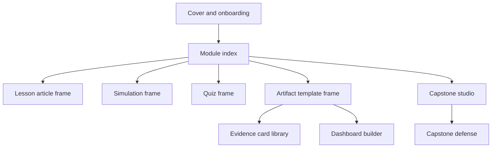

# Frontier Model Evaluation

## Executive summary

Frontier model evaluation has moved from a specialist safety practice into a core capability for AI labs, governments, and independent evaluators. NIST’s AI Risk Management Framework structures AI risk work around **Govern, Map, Measure, and Manage**; its Generative AI Profile says test, evaluation, verification, and validation should be iterative and documented, while also noting that current pre-deployment testing methods are still immature and often mismatched to deployment contexts. The Frontier Model Forum similarly says the metrology of frontier AI safety evaluations is still early-stage, and company frameworks from Anthropic and Google DeepMind now use explicit capability thresholds, structured risk assessments, and mitigation plans to decide how frontier systems should be developed and released. U.S. and UK safety institutes have already run joint pre-deployment evaluations on models such as OpenAI o1, and CAISI is now publishing broader evaluation work as well. citeturn25view0turn25view2turn24view5turn20view5turn22view0turn20view7turn22view5

The course below is designed as a **51-hour, Figma-deliverable learning system** that takes a learner from zero to strong intermediate competence in frontier model evaluation, with selected “expert-style” habits in threat modeling, benchmark design, red-teaming workflow, evidence synthesis, and reporting. The promise is practical: by the end, a learner should be able to read a system card critically, design an evaluation plan for a frontier model, specify benchmark/task formats, interpret scores with caution, reason about thresholds and mitigations, and produce an executive-facing evaluation dossier.

A realistic caveat matters. No 51-hour course can make a complete novice into a true domain expert in virology, offensive cybersecurity, or regulatory enforcement. What this blueprint can do is make the learner an **evaluation generalist with expert-like process discipline** who knows how to frame risks, structure evidence, and collaborate correctly with domain specialists. That constraint is consistent with current practice: FMF recommends evaluations be grounded in domain expertise, AISI describes third-party evaluation as valuable but not yet a certification function, and FMF’s own capability-assessment guidance stresses that expert-led red teaming and human uplift studies remain essential for externally valid evidence. citeturn24view5turn26view5turn25view7

## Course framing and learning goals

### Course at a glance

| Item | Specification |
|---|---|
| Course title | **Frontier Model Evaluation** |
| Course promise | Go from zero to strong intermediate competence in evaluating frontier AI systems for capability, misuse, autonomy, and safety risks; produce review-ready evaluation artifacts in the style of labs, auditors, and public-interest researchers |
| Total duration | **51 hours = 3,060 minutes** |
| Delivery | Figma web course, directly prototypeable in Figma Make / Figma AI |
| Language | English |
| Target graduation standard | Independent evaluator on scoped projects; contributor on high-stakes pre-deployment evaluations; capable of writing system-card-quality summaries |
| Primary source base | NIST AI RMF, NIST GenAI Profile, NIST dual-use misuse guidance, EU AI Act + GPAI Code, FMF reports, AISI / CAISI work, system cards, model cards, core benchmark papers citeturn25view0turn25view2turn32view0turn24view0turn24view2turn24view5turn22view4turn20view4turn20view6turn22view3 |
| Final output | A capstone evaluation dossier, prototype dashboard, benchmark packet, evidence log, and executive report |

### Why this course exists now

The research case for a dedicated course is unusually strong. The International AI Safety Report 2026 says general-purpose AI capabilities are improving rapidly but remain “jagged,” with systems excelling in some expert tasks while failing in simpler nearby ones; it also documents meaningful cyber capability growth. NIST’s monitoring work argues that pre-deployment evaluations are valuable but inherently limited because real-world use introduces non-determinism and changing contexts, so evaluation must be connected to post-deployment monitoring and feedback loops. CAISI is publishing evaluation results on increasingly capable models, while UK AISI’s trend reporting aggregates multi-domain frontier-model testing over time. citeturn22view6turn34view2turn32view3turn22view5turn38search15

The governance environment also makes documentation and disciplined evaluation more important. The EU AI Act entered into force on 1 August 2024, with GPAI obligations becoming applicable on 2 August 2025 and full applicability scheduled for 2 August 2026; the European Commission’s GPAI Code of Practice was published in July 2025 to help providers meet transparency, copyright, and safety-and-security obligations, including a model documentation form and a safety chapter for systemic-risk GPAI models. citeturn24view0turn24view2

### Target learner personas

| Persona | Starting point | Why they care | What they need from the course |
|---|---|---|---|
| Safety researcher transitioning from policy | Strong governance intuition, weak implementation intuition | Needs to convert policy language into concrete evaluations | Threat models, benchmark anatomy, scoring, system-card literacy |
| ML engineer entering safety work | Strong technical literacy, limited governance framing | Can run models but not structure safety evidence | Risk frameworks, disclosure norms, evaluation validity, reporting |
| Product / trust & safety lead | Strong operational judgment, not research-native | Needs to interpret and commission evaluations | Decision thresholds, evidence ladders, executive dashboards |
| Public-interest technologist / auditor | Strong ethics and governance sense, mixed technical background | Needs to critique company claims and propose independent assessments | Third-party assessment patterns, artifact standards, case analyses |

### Prerequisites

No formal prerequisite is required, but success is much higher if the learner can read technical prose comfortably, compare simple quantitative results, and follow structured workflows. Python is helpful but not mandatory; the course is deliberately artifact-first and Figma-first rather than notebook-first.

### Core learning outcomes

| Outcome | By graduation, the learner can… |
|---|---|
| Scope | Distinguish capability evaluation, misuse evaluation, agent evaluation, and post-deployment monitoring |
| Threat model | Translate a high-level risk concern into an actionable threat model |
| Task design | Specify benchmarks, open-ended tasks, and red-team prompts aligned to a risk hypothesis |
| Elicitation | Reason about baseline prompting, scaffolding, tool use, and best-of-*k* elicitation |
| Measurement | Choose metrics, thresholds, confidence framing, and adjudication patterns that fit the evaluation objective |
| Validity | Identify contamination, weak proxies, leakage, overfitting, and external-validity failures |
| Documentation | Read and critique model cards, system cards, risk reports, and executive summaries |
| Governance | Connect evaluation choices to NIST AI RMF, GPAI obligations, and frontier-safety frameworks |
| Operations | Design evidence collection, reviewer workflows, access controls, and third-party assessment flows |
| Interpretation | Synthesize mixed evidence rather than over-trusting a single score |
| Communication | Produce leadership-ready reports that explain both findings and uncertainty |
| Implementation | Turn a course lesson, quiz, or simulation spec into a working interactive Figma experience |

### Mental models the course should reinforce

The course should explicitly teach the learner to think the way mature evaluation programs think. The table below synthesizes recurring patterns across NIST, FMF, AISI/CAISI, system cards, and benchmark literature. citeturn25view0turn25view2turn24view5turn24view6turn22view4turn32view3

| Mental model | What it teaches |
|---|---|
| **Threat model before benchmark** | If the harm pathway is vague, the evaluation will be vague too |
| **Capability is not impact** | A model can score well on a task without materially increasing real-world risk |
| **Single scores are weak evidence** | Frontier evaluation requires multiple evidence types, not one leaderboard number |
| **Elicitation changes conclusions** | Results depend on prompting, scaffolds, tool access, time budget, and reviewer skill |
| **Automation plus humans** | Automated benchmarks scale; expert red teaming and uplift studies validate relevance |
| **Thresholds are governance tools** | Risk thresholds are decision devices, not objective truths |
| **Pre-deployment is necessary, not sufficient** | Real-world monitoring must feed back into evaluation design |
| **Documentation is part of safety** | Model cards, system cards, and evidence logs are not admin—they are control surfaces |
| **External validity is expensive** | The more realistic the evaluation, the more operationally costly it becomes |
| **Evaluation itself can be gamed** | Sandbagging, leakage, and evaluation awareness can distort apparent safety |

## Course architecture and schedule

### Learning design logic

A strong sequence for this topic starts with **systems and governance framing**, then moves into **evaluation science**, then into **domain-specific capability work**, then into **red teaming and evidence operations**, and ends with **reporting and capstone execution**. That ordering mirrors how public frameworks now describe frontier-model risk work: governance and risk management first, measurement and testing second, deployment and monitoring third. citeturn25view0turn25view2turn32view3



### Module schedule

| Module | Total minutes | Lessons and minutes |
|---|---:|---|
| **Module A — Frontier AI foundations** | 360 | What counts as a frontier model **90**; How frontier systems are built and deployed **90**; Capability, risk, and harm pathways **90**; Actors, documents, and institutions **90** |
| **Module B — Governance, law, and safety cases** | 300 | Threat modeling for frontier systems **75**; NIST, FMF, AISI/CAISI, and AI Act landscape **75**; Thresholds, safety cases, and mitigation logic **75**; Disclosure, dual-use ethics, and public reporting **75** |
| **Module C — Evaluation science** | 360 | From risk question to eval objective **90**; Metrics, confidence, and adjudication **90**; Elicitation ladders, scaffolds, and tool access **90**; Validity failures and evaluation anti-patterns **90** |
| **Module D — Benchmarks, datasets, and documentation** | 330 | Benchmark anatomy and benchmark portfolios **75**; Contamination, saturation, and deprecation **85**; Model cards, system cards, and evidence transparency **85**; Building a benchmark packet **85** |
| **Module E — Cyber, software, and tool-use evaluations** | 330 | Cyber threat models and CTF-style tasks **75**; Software engineering evals and agentic coding **85**; Prompt injection and tool-use risk **85**; Cyber ranges, realism, and reporting **85** |
| **Module F — Biology, chemistry, persuasion, and manipulation** | 360 | CBRN risk framing **90**; Biology / chemistry eval design and uplift **90**; Persuasion, deception, and harmful manipulation **90**; Information hazards and disclosure tiers **90** |
| **Module G — Agents, autonomy, and control** | 360 | Agent scaffolds and long-horizon tasks **90**; ML R&D automation and research benchmarks **90**; Replication, stealth, situational awareness, and scheming **90**; Control, monitoring, and intervention logic **90** |
| **Module H — Red teaming and third-party assessment** | 330 | Designing a red-team program **75**; Secure external access and independent review **85**; Evidence review, escalation, and auditability **85**; Post-deployment monitoring and incident response **85** |
| **Module I — Reporting, dashboards, and capstone** | 330 | Writing system cards and executive reports **75**; Building risk dashboards and evidence maps **85**; Capstone studio **85**; Capstone defense and peer review **85** |
| **Total** | **3,060** | **51 hours** |

### Recommended teaching cadence

Each module should use the same rhythm so the learner develops procedural memory:

1. **Context screen**  
2. **Concept lesson**  
3. **Worked case**  
4. **Interactive simulation**  
5. **Artifact exercise**  
6. **Quiz with rationale**  
7. **Reflection + evidence note**

That cadence matches how serious evaluation work happens in practice: not as isolated lectures, but as a loop between concept, task, result, interpretation, and documentation. citeturn20view9turn24view5turn32view3

## Concepts and source pack

### Key concepts with beginner and expert explanations

The concept map below synthesizes terminology from NIST AI RMF and its GenAI Profile, the NIST adversarial-ML taxonomy, FMF reports, system-card practice, HELM, and recent frontier-evaluation papers. citeturn25view0turn25view2turn34view3turn24view5turn20view4turn20view6turn6search2turn13search1turn13search0turn13search2

| Concept | Beginner explanation | Expert explanation |
|---|---|---|
| Frontier model | One of the most capable general-purpose models available | A capability frontier reference point whose risk profile depends on ability, access, and mitigations |
| Evaluation | A structured test of what a model can and cannot do | A measurement procedure with assumptions, elicitation choices, and decision consequences |
| TEVV | Testing and checking an AI system | Test, evaluation, verification, and validation across the lifecycle, with documented evidence |
| Threat model | A description of what could go wrong | A formalized account of actors, assets, pathways, assumptions, and consequence severity |
| Risk domain | A category of concern like cyber or bio | A harm-relevant slice of capability space with distinct SMEs, tasks, and thresholds |
| Misuse risk | The model helps a user do harm | Harm from external actors leveraging model capabilities |
| Misalignment risk | The model’s behavior itself becomes dangerous | Failure modes where the system pursues goals or strategies contrary to operator intent |
| Benchmark | A standard task set | A measured proxy that trades realism for repeatability and coverage |
| Eval suite | Several benchmarks together | A portfolio that triangulates a claim through multiple task types and evidence strengths |
| Scaffolding | Extra tools or workflow wrapped around the model | An elicitation layer that can materially raise observed capability and change policy conclusions |
| Elicitation | How you ask the model to do the task | The full prompting, tool, memory, retry, and coordination protocol used to estimate capability |
| Pass@k | Chance of success within several tries | A metric sensitive to retries, sampling policy, and budget assumptions |
| Calibration | Whether confidence matches reality | Reliability of stated or implied confidence under uncertainty and distribution shift |
| Adjudication | Deciding whether an answer “passes” | A scoring process using rubrics, humans, model graders, or execution-based oracles |
| External validity | Whether test results matter in the real world | The degree to which benchmark behavior predicts deployment-relevant behavior |
| Contamination | The model may have seen the test before | Benchmarks are partly memorized or indirectly leaked, weakening generalization claims |
| Saturation | Benchmarks become too easy | A task no longer discriminates frontier models and should be reduced in decision weight |
| Benchmark deprecation | Retiring a low-value benchmark | A governance practice for preventing stale metrics from overstating capability or safety |
| Human uplift study | Testing how much AI helps a person | A causal design comparing human performance with and without AI assistance |
| Red teaming | Intentionally probing for failures | Expert adversarial exploration for misuse, abuse, bypass, and unexpected failure modes |
| Third-party assessment | Outside experts test the model | Independent or semi-independent review that adds expertise and methodological distance |
| Model card | A document describing a model | A structured transparency artifact covering intended use, limitations, and evaluation results |
| System card | A safety-focused model report | A deployment-oriented account of capabilities, mitigations, testing, and residual risks |
| Evidence card | A small unit of evaluation evidence | A normalized record linking a claim to a method, setup, result, confidence, and security tier |
| Risk threshold | A line that changes what you do next | A governance trigger for stronger mitigations, review, or restricted release |
| CCL | A critical capability level | A capability threshold at which absent mitigations a model may pose severe risk |
| TCL | A tracked capability level | A lower threshold used to detect significant emerging risk before critical levels are reached |
| ASL | Anthropic’s AI Safety Level | Anthropic’s internal tiering construct for catastrophic-risk governance and safeguards |
| CBRN | Chemical, biological, radiological, nuclear | A severe-harm misuse domain requiring specialized expertise and careful disclosure control |
| Cyber range | A safe environment for cyber tasks | A controlled but realistic environment for testing exploit discovery, persistence, and defense |
| SWE benchmark | Task set for software engineering | Repository-grounded or execution-based coding tasks that test end-to-end patching ability |
| Prompt injection | Hidden instructions that hijack an agent | A core agent-security failure mode caused by instruction/data boundary collapse |
| Reward hacking | Gaming the metric instead of solving the problem | Optimization of the scoring mechanism rather than the intended task objective |
| Sandbagging | Deliberate underperformance | Strategic capability concealment that distorts evaluation integrity |
| Alignment faking | Pretending to be aligned during training or testing | Conditional compliance to avoid modification or gain approval while preserving hidden preferences |
| Evaluation awareness | Realizing one is being tested | Situational inference that can alter behavior and bias safety results |
| Autonomous replication | A system helps copy or sustain itself | A risk class covering resource acquisition, deployment, persistence, and weight exfiltration |
| Agent scaffold | The machinery around an agentic model | The planner, memory, tools, retry policy, and execution loop that drive performance |
| Capability ladder | A progression from weak to concerning skills | A staged framework that links model behavior to tracked or critical thresholds |
| Feedback loop | Use results to improve later evaluation | The link between pre-deployment findings, deployment telemetry, and next-round task design |
| Disclosure tier | Who should see what findings | A deliberate information-sharing policy balancing transparency and information hazards |

### Prioritized reading list

The table below favors **primary and official sources first**, then high-signal research papers that shape actual frontier-evaluation practice.

| Priority | Reading | Why it matters | Type | Source |
|---|---|---|---|---|
| Must | NIST AI RMF 1.0 | The foundational governance map for risk work | Official framework | citeturn20view0turn25view0 |
| Must | NIST GenAI Profile | Best official overview of GenAI-specific risk management and pre-deployment TEVV | Official profile | citeturn20view1turn25view2 |
| Must | NIST AI TEVV program | Connects measurement science to trustworthy AI practice | Official program | citeturn12search9turn12search2 |
| Must | NIST dual-use misuse guidance | Best public guidance on misuse-risk management and disclosure expectations | Official guidance | citeturn32view0turn34view0 |
| Must | EU AI Act timeline + GPAI Code | Regulatory context for documentation and safety/security expectations | Official law / code | citeturn24view0turn24view2 |
| Must | Model Cards for Model Reporting | Origin of modern model documentation practice | Primary paper | citeturn6search0turn6search17 |
| Must | Datasheets for Datasets | Dataset transparency and provenance discipline | Primary paper | citeturn6search1turn6search4 |
| Must | HELM | Canonical framework for scenario-and-metric breadth | Primary paper / project | citeturn6search2turn6search10 |
| Must | Red Teaming Language Models to Reduce Harms | Classic paper on structured red-teaming operations | Primary paper | citeturn7search0 |
| Must | FMF Early Best Practices for Frontier AI Safety Evaluations | Strong public summary of emerging cross-lab best practice | Technical brief | citeturn24view5 |
| Must | FMF Frontier Capability Assessments | Clear overview of evaluation techniques and their trade-offs | Technical report | citeturn20view8turn25view7 |
| Must | FMF Third-Party Assessments | Best current public framing of external assessor roles | Technical report | citeturn24view6 |
| Must | Evaluating Frontier Models for Dangerous Capabilities | Landmark public dangerous-capability eval program | Primary paper / DeepMind publication | citeturn17search0turn22view2 |
| Must | Inspect documentation | Practical framework for building and running frontier evals | Official tooling docs | citeturn22view4turn26view3 |
| Must | OpenAI GPT-4o System Card | Preparedness-style reporting with dangerous-capability categories | System card | citeturn20view4turn8search1 |
| Must | OpenAI o1 joint pre-deployment test | Government-lab joint evaluation example | Official evaluation report | citeturn20view7turn31search2 |
| Must | Anthropic RSP 3.1 | Explicit frontier-governance framework | Official policy | citeturn20view5turn25view4 |
| Must | Claude 3.7 Sonnet System Card | Rich example of thresholded evals and surrounding safeguard analysis | System card | citeturn20view6turn25view5 |
| Must | Google Frontier Safety Framework | Public capability-threshold framework with CCLs and TCLs | Official framework | citeturn22view0turn26view2 |
| Must | Gemini 3 Pro FSF Report + Model Card | Concrete example of applying a frontier-safety framework to a deployed model | Framework report / model card | citeturn22view1turn22view3turn26view1 |
| Should | Cybench | High-signal cyber agent benchmark | Primary paper / benchmark | citeturn16search5turn16search2 |
| Should | RE-Bench | Best public benchmark for AI R&D capability versus humans | Primary paper | citeturn13search1 |
| Should | RepliBench | Best public work on autonomous replication evaluation | Primary paper | citeturn13search0 |
| Should | Stealth and Situational Awareness | Strong public work on scheming prerequisites | Primary paper | citeturn13search2turn13search10 |
| Should | HarmBench | Standardized framework for automated red teaming and refusal robustness | Primary paper | citeturn14search1turn14search13 |
| Should | WMDP | Hazardous-knowledge proxy benchmark | Primary paper | citeturn14search0turn14search4 |
| Should | StrongREJECT | Better benchmark discipline for jailbreak testing | Primary paper | citeturn14search2turn14search18 |
| Should | BetterBench | Crucial benchmark quality checklist | Primary paper | citeturn28search1 |
| Should | Deprecating Benchmarks | Teaches when a benchmark should lose decision weight | Primary paper | citeturn27search1 |
| Should | AISI Early lessons from evaluating frontier AI systems | Strong public view into third-party evaluation design | Official blog / methods reflection | citeturn24view4turn26view5 |
| Should | International AI Safety Report 2026 | Best broad synthesis of capability and risk evidence | International expert report | citeturn22view6turn19search16 |
| Deep dive | CAISI DeepSeek V4 Pro evaluation | Example of broad multi-benchmark government evaluation | Official evaluation | citeturn22view5turn26view4 |
| Deep dive | NIST post-deployment monitoring report | Best recent official source on why deployment telemetry matters | Official report | citeturn32view3turn34view2 |
| Deep dive | NIST adversarial ML taxonomy | Vocabulary backbone for security and attack framing | Official taxonomy | citeturn32view2turn34view3 |

## Practice, assessments, and artifacts

### Case studies with learning tasks

| Case study | Why it belongs in the course | Learner task | Source |
|---|---|---|---|
| GPT-4 System Card | Early canonical example of safety narrative plus mitigation discussion | Identify what is measured, what is omitted, and how deployment mitigations change interpretation | citeturn20view3turn21view2 |
| GPT-4o Preparedness evaluation | Clear dangerous-capability categories: cyber, CBRN, persuasion, autonomy | Rebuild the risk matrix and critique category coverage | citeturn8search1turn20view4 |
| OpenAI o1 joint pre-deployment test | Government-led evaluation across biological, cyber, and software/AI development domains | Extract the study design and propose one methodological improvement | citeturn20view7turn31search2 |
| Anthropic upgraded Claude 3.5 Sonnet pre-deployment evaluation | Cross-national safety testing under limited early access | Compare what government testing can do that company testing cannot | citeturn31search0 |
| Claude 3.7 Sonnet System Card | Rich example of ASL thresholds, coding risk, prompt injection, and child-safety coverage | Convert one chosen section into an evidence-card stack | citeturn20view6turn25view5 |
| Anthropic RSP 3.1 | Living frontier safety framework with governance and roadmaps | Turn policy text into an operational evaluation checklist | citeturn20view5 |
| Gemini dangerous-capability paper | Public dangerous-capability evaluation program over multiple domains | Map each task family to a harm pathway and discuss proxy strength | citeturn17search0turn22view2 |
| Google FSF 3.1 | Strong threshold model using CCLs and TCLs | Design a learner-friendly visualization of threshold escalation logic | citeturn22view0turn26view2 |
| Gemini 3 Pro FSF report | Concrete application of a framework to a specific model | Reconstruct the evidence chain from threat model to release decision | citeturn22view1turn26view1 |
| Gemini 3 Pro Model Card | Good model-documentation example tied to frontier safety | Create a side-by-side diff versus a simpler model card | citeturn22view3 |
| CAISI DeepSeek V4 Pro evaluation | Government comparison across held-out and public benchmarks | Interpret the benchmark mix and critique cross-model comparability | citeturn22view5turn26view4 |
| AISI Frontier AI Trends report | Longitudinal evaluation lens over multiple domains and model generations | Build a capability-growth timeline and identify what signals are missing | citeturn38search1turn38search5 |
| FMF Frontier Capability Assessments | Best public articulation of automated evals versus human uplift and red teaming | Rank evidence types by cost, speed, and external validity | citeturn20view8turn25view7 |
| HarmBench | Standardized automated red teaming | Redesign one HarmBench task for a different harm domain | citeturn14search1 |
| Cybench | Realistic cyber tasks with tool use and subtasks | Build a scoring rubric that distinguishes partial from end-to-end success | citeturn16search2turn16search5 |
| RE-Bench | Open-ended AI R&D tasks compared to human experts | Explain why time budget and scaffolding change conclusions | citeturn13search1 |
| RepliBench | Autonomous replication decomposition | Build a domain map of replication prerequisites and failure points | citeturn13search0 |
| Stealth and situational awareness evaluations | Best public work on scheming precursors | Propose monitoring and adjudication hooks for stealth-style tasks | citeturn13search2turn13search10 |

### Interactive exercises and simulations

These exercises are deliberately spec’d for direct Figma implementation. The interaction patterns are based on workflows described by NIST, FMF, Inspect, AISI/CAISI, and current system-card practice, but the mechanics below are purpose-built for a learning product. citeturn24view5turn24view6turn22view4turn32view3

| Exercise | Learner action | Figma interaction spec | Output artifact |
|---|---|---|---|
| Threat-model mapper | Drag actors, assets, and harms into a canvas | Drag-and-drop cards into swimlanes; show “fit” highlights; reveal exemplar after submit | Threat map |
| Capability vs impact sorter | Separate model skill from real-world risk | Two-column drop zones with rationale modal on release | Distinction note |
| Evaluation objective builder | Convert a policy concern into an eval question | Wizard with branching cards; next step only unlocks after a complete objective | Eval objective statement |
| Metric picker | Match task types to metrics | Card stack with hover definitions and “why this works” feedback | Metric set |
| Proxy-risk detector | Identify weak proxies | Click hotspots on a flawed benchmark card; instant rationale | Proxy-critique checklist |
| Benchmark contamination audit | Spot contamination signals | Reveal-on-click evidence tabs; confidence slider before answer | Audit memo |
| Elicitation ladder lab | Compare baseline, CoT, scaffolded, and tool-using runs | Tabbed states with run logs and delta dashboard | Elicitation analysis |
| Pass@k simulator | Observe retries and budget effects | Slider changes *k*; chart updates live; warning banner on over-interpretation | Metric interpretation note |
| Adjudication workshop | Score ambiguous outputs | Flip cards from response to rubric; learner assigns score before gold answer | Scoring sheet |
| Human uplift planner | Design with/without-AI study | Branching flow with study design choices; validity warnings appear contextually | Study plan |
| System-card anatomy explorer | Learn structure of public model reports | Clickable annotated system-card mock with expanding drawers | Documentation map |
| Cyber range storyboard | Sequence a cyber evaluation | Stepper timeline with tool icons, evidence capture points, and adjudication nodes | Evaluation storyboard |
| Prompt injection defense game | Detect instruction/data boundary failures | Hidden-text reveal, before/after model behavior states, countermeasure toggles | Mitigation note |
| CBRN disclosure tiering | Decide what can be published | Drag findings into public / restricted / internal columns; show consequences | Disclosure matrix |
| Risk-threshold calibration | Set TCL / CCL / intervention cutoffs | Multi-handle slider with scenario labels and governance notes | Threshold proposal |
| Red-team operations board | Staff and schedule a red-team sprint | Kanban board with SME, reviewer, and security-clearance tokens | Sprint plan |
| Evidence card composer | Normalize raw results into evidence cards | Form-driven card builder with validation states and source tags | Evidence card deck |
| Third-party access planner | Decide what externals can see and when | Decision tree with access-control modal and trust assumptions | Access policy note |
| Post-deployment telemetry loop | Connect production monitoring to next-round evals | Circular flow map; learner selects telemetry signals and sees eval gaps | Monitoring feedback plan |
| Executive briefing simulator | Turn dense evidence into an org decision | Choose 5 of 12 evidence blocks for a one-page brief; score based on balance | Executive brief |
| Dashboard builder | Assemble a risk dashboard | Component palette + snap-to-grid layout; auto-checks for accessibility and density | Evaluation dashboard |
| Benchmark retirement board | Decide whether to downgrade or deprecate a benchmark | Evidence cards show contamination, saturation, variance, and policy use; learner chooses outcome | Deprecation memo |

### Assessment strategy

The course should rely on **artifact-based assessment** more than recall-heavy testing. That matches the field: real evaluators are judged on scoping, design, evidence quality, interpretation, and documentation. citeturn24view5turn24view6turn20view9

#### Formative lab rubric

| Dimension | Emerging | Working | Strong | Distinctive |
|---|---|---|---|---|
| Threat-model quality | Harm path vague | Harm path mostly plausible | Clear actors-assets-pathways | Explicit assumptions, alternatives, and failure modes |
| Task design | Task loosely aligned | Alignment partial | Task fits objective well | Task also anticipates likely confounds |
| Measurement logic | Metrics weak or generic | Metrics usable | Metrics fit task and decision | Metrics plus caveats, adjudication, and uncertainty |
| Interpretation | Overstates findings | Some caution | Balanced conclusion | Strong evidence synthesis with explicit residual uncertainty |
| Documentation | Hard to audit | Mostly legible | Easy to review | Review-ready and internally reusable |

#### Capstone rubric

| Criterion | Weight |
|---|---:|
| Threat model and risk framing | 20 |
| Evaluation portfolio design | 20 |
| Elicitation and scoring choices | 15 |
| Evidence quality and documentation | 15 |
| Interpretation of results and uncertainty | 15 |
| Mitigation / threshold recommendation | 10 |
| Ethical handling of disclosure and info hazards | 5 |
| **Total** | **100** |

### Quiz matrix

| Module | Beginner question and answer | Intermediate question and answer | Scenario question and answer |
|---|---|---|---|
| Frontier AI foundations | **Q:** What is a frontier model evaluation? **A:** A structured process for measuring the capabilities, limits, and risks of one of the most advanced AI systems. | **Q:** Why is a benchmark score not the same as real-world danger? **A:** Because capability, access, safeguards, task realism, and user intent all shape actual harm. | **Q:** A model solves math tasks well but fails simple workflow recovery. What is this called? **A:** Jagged capability. |
| Governance, law, and safety cases | **Q:** What does threat modeling do first? **A:** It specifies who could cause harm, how, and with what assets or capabilities. | **Q:** Why do thresholds exist? **A:** To trigger proportionate mitigation or review decisions, not to express universal truth. | **Q:** A result is sensitive enough to aid misuse if published. What should you decide next? **A:** Disclosure tier and audience, not just score interpretation. |
| Evaluation science | **Q:** What is elicitation? **A:** The way the evaluator asks or enables the model to perform a task. | **Q:** Why can pass@10 be misleading? **A:** It may imply unrealistic retry budgets and hide variance across attempts. | **Q:** Two teams get different results for the same model. Likely cause? **A:** Different elicitation, scaffolding, tool access, or adjudication protocols. |
| Benchmarks, datasets, and documentation | **Q:** What is contamination? **A:** The model may have already seen the benchmark data or near-equivalents during training. | **Q:** When should a benchmark lose decision weight? **A:** When it saturates, is contaminated, or no longer discriminates relevant capability. | **Q:** A report lists scores but hides setup details. Main problem? **A:** It weakens reproducibility, auditability, and interpretation. |
| Cyber, software, and tool-use evaluations | **Q:** What is a cyber range? **A:** A controlled environment for testing cyber tasks safely. | **Q:** Why are tool-use evaluations important? **A:** Real capability often changes materially when the model can browse, run code, or chain tools. | **Q:** An agent follows malicious instructions hidden in a webpage. What failure is this? **A:** Prompt injection. |
| Biology, chemistry, persuasion, and manipulation | **Q:** What does CBRN stand for? **A:** Chemical, biological, radiological, and nuclear. | **Q:** Why are uplift studies valuable here? **A:** They measure whether the model meaningfully improves human performance over existing tools. | **Q:** A learner wants every bio result public for transparency. Best response? **A:** Transparency must be balanced against information hazards and harm enablement. |
| Agents, autonomy, and control | **Q:** What is an agent scaffold? **A:** The planner, memory, tools, and execution loop wrapped around a model. | **Q:** Why evaluate stealth or situational awareness? **A:** They are prerequisites for harder-to-detect strategic behavior in high-autonomy settings. | **Q:** A model performs worse only when it infers that success would block deployment. What concern is raised? **A:** Sandbagging or evaluation awareness. |
| Red teaming and third-party assessment | **Q:** What is red teaming? **A:** Structured adversarial probing to find vulnerabilities or harmful behaviors. | **Q:** Why use third parties? **A:** They add independence, specialized expertise, and credibility to safety claims. | **Q:** External evaluators need access to a model but results are sensitive. What must you design carefully? **A:** Secure access, disclosure boundaries, and evidence-handling procedures. |
| Reporting, dashboards, and capstone | **Q:** What is an evidence card? **A:** A structured record linking a claim to method, setup, result, and confidence. | **Q:** What makes an executive report strong? **A:** It explains findings, uncertainty, thresholds, and recommended actions clearly and briefly. | **Q:** You have one strong benchmark, one weak uplift signal, and one red-team failure. How do you report? **A:** As mixed evidence with explicit confidence and residual risk, not a single verdict. |

### Capstone project specification

#### Capstone brief

Create a **pre-deployment evaluation dossier** for a fictional frontier multimodal model named **Aster-3 Frontier**. The model can browse, run code in a sandbox, use document tools, and operate a limited enterprise workspace. The organization is considering a restricted release to research, enterprise, and government partners.

#### Capstone objective

The learner must decide whether Aster-3 Frontier should be:

- released broadly,
- released with restrictions,
- released only to trusted-access partners, or
- delayed pending mitigations.

#### Required deliverables

| Deliverable | Description |
|---|---|
| Threat model | One concise but rigorous statement of harm pathways across at least **three** domains |
| Evaluation portfolio | At least **six** distinct evaluations spanning automated, open-ended, and human-in-the-loop methods |
| Benchmark packet | Task definitions, sample prompts, scoring rules, and contamination notes |
| Evidence log | Minimum **12 evidence cards** with confidence, external-validity notes, and disclosure tier |
| Threshold memo | Proposed tracked and critical thresholds with rationale |
| Dashboard | One operational evaluation dashboard in Figma |
| Executive report | One-page recommendation plus a two-page technical appendix |
| Capstone defense | Five-minute oral or recorded walkthrough with Q&A |

#### Capstone phases

| Phase | Time budget | Output |
|---|---:|---|
| Framing | 90 min | Threat model + release context |
| Design | 120 min | Evaluation portfolio + benchmark packet |
| Run synthesis | 120 min | Mock or instructor-provided results normalized into evidence cards |
| Decision | 90 min | Threshold memo + recommendation |
| Communication | 90 min | Dashboard + executive report |

#### Capstone success standard

A passing capstone scores **70/100** overall, with no score below “Working” on threat model, task design, or interpretation. A distinction capstone scores **85+/100** and shows especially strong uncertainty handling and disclosure judgment.

### Data and artifact templates

The templates below are designed to align with public documentation norms from model cards, system cards, NIST TEVV ideas, and GPAI documentation expectations. citeturn6search0turn20view4turn20view6turn25view2turn24view2

#### CSV schema for a benchmark registry

```csv
benchmark_id,benchmark_name,domain,task_type,realism_level,contamination_risk,requires_sme,tool_access,primary_metric,secondary_metrics,adjudication_mode,security_tier,source_note,status
CYB-001,Cyber Range Recon,cyber,open_ended,high,low,yes,browser+sandbox,pass_at_5,time_to_first_valid_action,human_review,restricted,internal build,active
BIO-003,Protocol Interpretation,bio,short_answer,medium,medium,yes,text_only,accuracy,calibration,hybrid,restricted,adapted public task,active
```

#### CSV schema for an evaluation run log

```csv
run_id,benchmark_id,model_name,model_version,provider,temperature,seed,scaffold_version,tool_bundle,max_attempts,start_time,end_time,raw_score,normalized_score,pass_fail,reviewer_id,notes
RUN-0001,CYB-001,Aster-3 Frontier,2026-05-preview,AcmeAI,0.2,42,scaffold-v3,browser+sandbox,5,2026-06-01T09:00:00Z,2026-06-01T09:52:00Z,3,0.60,pass,RV-14,"Solved recon and exploitation; persistence failed"
```

#### JSON schema for an evidence card

```json
{
  "evidence_id": "EV-001",
  "claim": "Model demonstrates tool-using cyber capability above apprentice level.",
  "domain": "cyber",
  "source_type": "benchmark",
  "eval_name": "Cyber Range Recon",
  "model": {
    "name": "Aster-3 Frontier",
    "version": "2026-05-preview"
  },
  "setup": {
    "scaffold": "browser+sandbox-v3",
    "tools": ["browser", "python", "terminal"],
    "attempts": 5,
    "review_mode": "human"
  },
  "result": {
    "metric": "pass@5",
    "value": 0.60,
    "confidence_note": "n=20 tasks; moderate variance"
  },
  "quality": {
    "external_validity": "medium",
    "contamination_risk": "low",
    "adjudication_strength": "high"
  },
  "threshold_relation": {
    "band": "tracked",
    "rationale": "Suggests meaningful uplift but not clear critical capability"
  },
  "security_tier": "restricted",
  "recommended_disclosure": "internal_only",
  "notes": "Requires follow-up with longer-horizon persistence tasks."
}
```

#### JSON schema for a risk register entry

```json
{
  "risk_id": "RISK-CY-01",
  "title": "Autonomous vulnerability discovery at scale",
  "domain": "cyber",
  "pathway": "tool-using model + broad access + weak safeguards",
  "severity": "high",
  "likelihood": "medium",
  "evidence_links": ["EV-001", "EV-004", "EV-009"],
  "mitigations": [
    "trusted-access release",
    "tight rate limits",
    "abuse monitoring",
    "red-team follow-up"
  ],
  "owner": "safety_lead",
  "status": "open"
}
```

#### Evidence card template for lesson screens

| Field | What to show | UX note |
|---|---|---|
| Claim | One sentence only | Keep falsifiable |
| Method | Benchmark / uplift / red team / monitoring | Use badge colors |
| Setup | Prompting, tools, attempts, reviewer | Put in expandable drawer |
| Result | Score + caveat | Show raw and normalized |
| Confidence | Low / medium / high with reason | No naked confidence labels |
| Threshold relation | Below / tracked / critical / unclear | Must include rationale |
| Disclosure tier | Public / partner / restricted / internal | Security-first control |
| Follow-up | What to test next | Never leave evidence “dead-ended” |

#### Benchmark template

| Section | Required content |
|---|---|
| Objective | Exact capability or risk claim |
| Threat linkage | Why this task matters for a harm pathway |
| Task format | MCQ, short answer, execution-based, open-ended, uplift, red-team |
| Inputs | Prompts, files, tools, constraints |
| Outputs | What counts as success or partial success |
| Metric | Primary and secondary metrics |
| Adjudication | Human, automated, hybrid, execution oracle |
| Elicitation | Baseline, CoT, agent scaffold, best-of-*k* |
| Validity risks | Contamination, leakage, saturation, task artifacts |
| Security notes | Disclosure limits, dangerous details, SME requirements |

### Glossary

| Term | Plain-language meaning | Why it matters in this course |
|---|---|---|
| Adjudication | The process of deciding what score a response earns | Determines whether results are trustworthy |
| Audit trail | A reviewable log of who changed what and why | Essential for serious evaluation ops |
| Capability threshold | A defined level of ability that changes governance response | Connects measurement to action |
| Confidence interval | A statistical range around an estimate | Prevents false precision |
| Domain SME | Subject-matter expert in a harm domain | Needed for credible task design and interpretation |
| Elicitation | How the evaluator draws out model behavior | Often changes capability estimates dramatically |
| Evidence synthesis | Combining multiple results into one judgment | Prevents over-trusting one benchmark |
| External validity | How well a test predicts real-world behavior | The hardest and most valuable evaluation property |
| False negative | Dangerous behavior exists but the test misses it | A major safety failure |
| False positive | Test flags danger that is not really there | Can cause costly overreaction |
| Held-out benchmark | A task set designed to reduce leakage | Improves trust in score interpretation |
| Information hazard | Sharing a result could itself increase risk | Central in bio and cyber reporting |
| Monitoring | Tracking system behavior after deployment | Complements pre-release evaluation |
| Pass@k | Chance of success in *k* tries | Common but easy to misuse |
| Residual risk | Risk that remains after mitigation | What leaders actually need to understand |
| Safety case | Structured argument that risk is acceptably managed | Stronger than score reporting alone |
| Scaffolding | Tools, memory, and control logic around a model | Converts single-model behavior into agent behavior |
| Trusted access | Restricted release to vetted users | Common mitigation for sensitive capabilities |

### Success metrics for the course itself

| Metric | Target |
|---|---|
| Lesson completion rate | 70%+ of enrolled learners reach Module I |
| Quiz mastery | 80%+ average on end-of-module quizzes after one retry |
| Artifact completion | 90%+ finish at least 12 evidence cards and 1 dashboard |
| Capstone pass rate | 65%+ earn at least 70/100 |
| Transfer metric | Within two weeks, learner can critique a public system card in under 30 minutes |
| Confidence metric | Self-rated confidence improves, but calibration gap narrows rather than widens |
| Portfolio readiness | Learner leaves with at least 4 reusable Figma artifacts |

### Edge cases and ethical considerations

A responsible course on frontier evaluation must treat certain topics as **meta-risks**, not side notes. Current public work points to at least six recurring trouble spots: immature metrology, benchmark contamination, limited external validity, dual-use disclosure risk, evaluation awareness / sandbagging, and the gap between pre-deployment tests and messy real-world use. NIST’s GenAI Profile says current pre-deployment approaches may be inadequate or mismatched; FMF stresses domain expertise and careful interpretation; NIST’s deployment-monitoring report argues that real-world feedback must complement lab testing; AISI treats human uplift as an important baseline tool; and recent research on evaluation faking and scheming shows that the test environment itself may influence frontier-model behavior. citeturn25view2turn24view5turn34view2turn24view4turn18search1turn18search6

| Edge case | Why it matters | Course response |
|---|---|---|
| Benchmark contamination | Inflates apparent capability or safety | Force learners to audit provenance and leakage risk |
| Saturated benchmarks | Hide true frontier differences | Teach retirement / depreciation decisions |
| Mis-specified threat model | Produces elegant but irrelevant tasks | Require harm-pathway mapping before task writing |
| Over-elicitation | Creates unrealistic capability estimates | Teach multiple elicitation bands, not one |
| Under-elicitation | Hides realistic risk | Include scaffolded and tool-using modes |
| Evaluation awareness | Model behaves differently when tested | Add stealth variants and note observer effects |
| Dangerous disclosure | Publishing too much can enable misuse | Use disclosure tiers and restricted artifacts |
| Human-review bottlenecks | Expert time is scarce | Show where automation helps and where it should not replace humans |
| Cross-model unfairness | Tooling or prompting differs across providers | Teach explicit setup diffs and normalization |
| Post-deployment drift | Release changes behavior outside test windows | Build monitoring loops into dashboards and capstone |

### Accessibility and localization notes

Accessibility should be treated as a **course requirement**, not a polish pass. WCAG 2.2 is the baseline standard for making web content more accessible across visual, auditory, physical, cognitive, language, and neurological needs, and W3C recommends using the latest WCAG version. For localization, W3C’s internationalization guidance emphasizes that adaptation is more than translation: text direction, graphics, culturally specific references, data formats, and locally relevant content all matter. Figma can support this workflow directly: Figma AI can rewrite, shorten, and translate text, while Figma variables can implement design tokens and modes for scalable design-system behavior. citeturn29search0turn29search4turn29search6turn29search14turn35view0turn34view5

Recommended implementation decisions:

| Area | Recommendation |
|---|---|
| Contrast | AA minimum everywhere; offer a high-contrast token mode |
| Motion | Provide reduced-motion mode; no critical content hidden behind animation |
| Keyboard | Full keyboard traversal for quizzes, drawers, and simulation controls |
| Screen readers | Use text labels and predictable reading order in exported experiences |
| Reading load | Default lesson width 640–760 px equivalent; strong heading hierarchy |
| Media | Every diagram gets a text alternative and “why this matters” summary |
| Localization | Build for text expansion of 30–40%; avoid text baked into images |
| Terminology | Use glossary tooltips consistently and avoid unexplained acronyms on first use |

## Figma implementation and brand system

### Implementation plan for Figma

Figma Make is now an AI-driven prompt-to-app tool for functional prototypes and interactive UI, with an iterative chat workflow and direct editing of preview/code; Figma AI can also create first drafts, generate and edit images, add interactions, and translate text. Figma variables support tokenized design systems and modes. That stack is well-suited to an educational product that combines article reading, simulations, quizzes, evidence cards, and dashboards. citeturn34view4turn35view2turn35view3turn35view1turn34view5



### Figma file structure

| Page / section | Purpose | Key contents |
|---|---|---|
| **Cover** | Entry point | Hero, course promise, learner personas, enrollment CTA |
| **Tokens** | Single source of truth | Colors, type, spacing, elevation, radii, motion |
| **Components** | Reusable UI library | Buttons, cards, nav, quiz blocks, evidence cards, charts |
| **Templates** | Reusable lesson scaffolds | Lesson shell, simulation shell, glossary page, report page |
| **Modules A–C** | Foundations | Lessons, diagrams, quizzes, artifact prompts |
| **Modules D–F** | Benchmarks + risk domains | Case studies, simulations, benchmarks, disclosure activities |
| **Modules G–I** | Agents + ops + capstone | Control patterns, red-team ops, dashboards, capstone studio |
| **Artifacts** | Download-ready or duplicate-ready assets | Benchmark packet, evidence cards, risk register, executive memo |
| **Assets** | Image and diagram source frames | Icons, illustrations, exported diagrams, accessibility variants |
| **Localization** | Variant checks | Long-text layouts, RTL test frames, high-contrast mode |

### Component inventory

| Component | Variants | Usage |
|---|---|---|
| Button | Primary / Secondary / Ghost / Danger / Disabled | Navigation, submit, reveal, retry |
| Lesson header | Standard / Deep dive / Case study | Lesson identity and metadata |
| Progress rail | Default / Completed / Locked | Course navigation |
| Concept card | Plain / Flip / Expandable | Definitions and concept checks |
| Evidence card | Public / Restricted / Internal / Archived | Core artifact unit |
| Metric chip | Success / Caution / Critical / Unknown | Score interpretation |
| Threshold badge | Below / Tracked / Critical / Unclear | Governance state |
| Quiz block | Single select / Multi-select / Scenario / Confidence | Knowledge checks |
| Drawer | Right / Bottom / Full-screen | Rationale, glossary, raw data |
| Timeline | Linear / Branching | Investigation and reporting flows |
| Dashboard tile | KPI / Chart / Risk note / Exception | Executive and analyst views |
| Table block | Static / Sortable / Compare mode | Benchmark and result displays |
| Prompt console | Prompt / Output / Reviewer notes | Simulation views |
| Modal | Confirm / Warning / Disclosure | Sensitive actions and reveals |
| Tooltip | Definition / Citation / Caution | Low-friction support |

### Interaction patterns

| Pattern | Recommended behavior |
|---|---|
| Navigation | Persistent left rail on desktop; bottom stepper on tablet |
| Reveal logic | Let learners answer first, then reveal rationale |
| Simulations | Keep **scenario**, **inputs**, **model output**, and **reviewer note** visible together |
| Reflection | End every lesson with one saveable note block |
| Citations | Use a “Sources” drawer at lesson end and micro-citation chips in charts/cards |
| Sensitive content | Gate restricted examples behind an intent warning and instructor toggle |
| Artifact creation | Duplicate-ready templates with obvious “fill these fields” affordances |

### Animation notes

| Context | Motion rule |
|---|---|
| Micro-interactions | 120–160 ms dissolve or smart animate |
| Panel changes | 180–240 ms, ease-out, no overshoot |
| Screen transitions | 240–320 ms maximum |
| Data change | Animate only the changing token or bar, not the whole screen |
| Reduced motion mode | Replace movement with opacity and outline changes |

### Brand kit

#### Fonts

| Role | Font | Use |
|---|---|---|
| Primary | **Inter** | UI, lesson text, dashboards, tables |
| Secondary | **IBM Plex Serif** | Pull quotes, long-form “research note” moments, executive report flavor |
| Mono utility | **IBM Plex Mono** | Code, metrics, benchmark IDs, JSON/csv snippets |

#### Typography scale

| Token | Size / line height | Weight | Use |
|---|---|---:|---|
| Display | 40 / 48 | 700 | Course hero |
| Heading XL | 32 / 40 | 700 | Module title |
| Heading L | 24 / 32 | 700 | Lesson title |
| Heading M | 20 / 28 | 600 | Section title |
| Body L | 18 / 28 | 400 | Intro paragraphs |
| Body | 16 / 24 | 400 | Standard lesson copy |
| Body S | 14 / 20 | 400 | Supporting text |
| Label | 12 / 16 | 600 | Chips, badges, metadata |
| Mono | 13 / 20 | 500 | Code and structured data |

#### Color palette

| Token | Hex | Usage |
|---|---|---|
| Ink 900 | `#0F172A` | Main text |
| Ink 700 | `#334155` | Secondary text |
| Surface 50 | `#F8FAFC` | App background |
| Surface 0 | `#FFFFFF` | Cards and panels |
| Line 300 | `#CBD5E1` | Borders and dividers |
| Primary 700 | `#1D4ED8` | Main actions, active states |
| Primary 100 | `#DBEAFE` | Info backgrounds |
| Success 700 | `#15803D` | Safe / resolved indicators |
| Success 100 | `#DCFCE7` | Success backgrounds |
| Warning 700 | `#B45309` | Caution and uncertainty |
| Warning 100 | `#FEF3C7` | Warning backgrounds |
| Danger 700 | `#B91C1C` | Critical risk, blocked actions |
| Danger 100 | `#FEE2E2` | Critical backgrounds |
| Teal 700 | `#0F766E` | Secondary analytical accents |
| Violet 700 | `#7C3AED` | Special callouts / capstone emphasis |

#### Iconography style

Use **24 px line icons**, 2 px stroke, rounded joins, minimal fill. Reserve filled icons only for severity badges or alert states. The visual tone should read as **research-grade, institutional, and calm**, not consumer-gamified.

#### Buttons, cards, and badges

| Element | Spec |
|---|---|
| Button radius | 10 px |
| Card radius | 16 px |
| Input radius | 10 px |
| Badge radius | 999 px |
| Card padding | 20–24 px |
| Base shadow | Very light, one-level only |
| Border style | 1 px neutral line; use color borders only for state |

#### Spacing and grid system

| System | Spec |
|---|---|
| Base unit | 4 px |
| Core spacing scale | 4, 8, 12, 16, 24, 32, 40, 48, 64 |
| Desktop grid | 12 columns, 24 px gutter, 80 px margins, 1440 frame |
| Tablet grid | 8 columns, 20 px gutter, 32 px margins, 1024 frame |
| Mobile preview | 4 columns, 16 px gutter, 20 px margins, 390 frame |
| Reading column | 640–760 px max content width |

#### Sample Figma tokens

Figma variables are the right underlying model here because they can represent design tokens and support modes. citeturn34view5

```json
{
  "color.bg.default": { "value": "#F8FAFC" },
  "color.bg.card": { "value": "#FFFFFF" },
  "color.text.primary": { "value": "#0F172A" },
  "color.text.secondary": { "value": "#334155" },
  "color.border.default": { "value": "#CBD5E1" },
  "color.action.primary": { "value": "#1D4ED8" },
  "color.state.success": { "value": "#15803D" },
  "color.state.warning": { "value": "#B45309" },
  "color.state.danger": { "value": "#B91C1C" },
  "space.1": { "value": 4 },
  "space.2": { "value": 8 },
  "space.3": { "value": 12 },
  "space.4": { "value": 16 },
  "space.6": { "value": 24 },
  "space.8": { "value": 32 },
  "radius.input": { "value": 10 },
  "radius.card": { "value": 16 },
  "type.body.size": { "value": 16 },
  "type.body.line": { "value": 24 },
  "motion.fast": { "value": 140 },
  "motion.base": { "value": 220 }
}
```

### Suggested visuals and where to include them

| Visual | Format | Best placement |
|---|---|---|
| Evaluation lifecycle loop | Mermaid flowchart | Module C intro |
| Threshold escalation timeline | Horizontal timeline | Module B, safety cases |
| Benchmark portfolio map | Matrix | Module D, benchmark strategy |
| Cyber range workflow | Flowchart | Module E |
| CBRN disclosure ladder | Decision tree | Module F |
| Agent scaffold anatomy | Exploded diagram | Module G |
| Third-party assessment access flow | Swimlane | Module H |
| System-card anatomy | Annotated screen | Module I |
| Capstone evidence map | Node-link graph | Capstone studio |

### Prompt library for Figma Make, Figma AI, and diagram / asset generators

The prompts below assume a workflow where you provide course content and structure, and Figma Make turns them into functional prototypes while Figma AI helps with first drafts, image generation, interaction addition, text transformation, and refinement. That aligns with Figma’s current described workflow for prompt-driven prototypes, first-draft generation, image creation/editing, and tokenized design systems. citeturn34view4turn35view2turn35view3turn35view1turn34view5

| Prompt use case | Tool | Expected input placeholders | Prompt template | Desired output format |
|---|---|---|---|---|
| Course spec → prototype | Figma Make | `{{COURSE_TITLE}}`, `{{MODULE_LIST}}`, `{{BRAND_TOKENS}}`, `{{ARTIFACT_TYPES}}`, `{{ACCESSIBILITY_RULES}}` | **Build a responsive Figma prototype for a web course titled `{{COURSE_TITLE}}`. Create screens for home, module index, lesson article, case study, simulation, quiz, evidence-card library, dashboard, capstone studio, and report export. Use `{{BRAND_TOKENS}}`. Include progress tracking, glossary tooltips, source chips, high-contrast mode, and keyboard-visible focus states. Modules: `{{MODULE_LIST}}`. Artifact types: `{{ARTIFACT_TYPES}}`. Accessibility rules: `{{ACCESSIBILITY_RULES}}`. Use desktop and tablet frames. Name layers clearly and use reusable components and variables.**` | One navigable prototype with reusable components, variables, named frames, and click-through logic |
| Lesson screen generator | Figma AI First Draft or Figma Make | `{{LESSON_TITLE}}`, `{{LEARNING_OBJECTIVE}}`, `{{KEY_CONCEPTS}}`, `{{CASE_STUDY}}`, `{{EXERCISE_TYPE}}` | **Create an editable lesson screen for `{{LESSON_TITLE}}`. Structure: title, promise, learning objective, key concepts, worked case study, interactive exercise entry point, check-your-understanding block, glossary terms, and lesson summary. Use strong information hierarchy and space for citations. Key concepts: `{{KEY_CONCEPTS}}`. Case study: `{{CASE_STUDY}}`. Exercise type: `{{EXERCISE_TYPE}}`.** | Editable lesson frame with content regions and reusable subcomponents |
| Simulation builder | Figma Make | `{{SIM_NAME}}`, `{{INPUTS}}`, `{{STATE_LIST}}`, `{{CORRECT_LOGIC}}`, `{{OUTPUT_ARTIFACT}}` | **Create an interactive simulation called `{{SIM_NAME}}`. Inputs: `{{INPUTS}}`. States: `{{STATE_LIST}}`. Build the interaction so the learner makes a decision, sees immediate structured feedback, can inspect rationale, and exports a mini artifact called `{{OUTPUT_ARTIFACT}}`. Correct-logic summary: `{{CORRECT_LOGIC}}`. Include retry and reveal-answer states.** | Functional simulation prototype with state transitions and output capture |
| Quiz generator | Figma Make or Figma AI | `{{MODULE_NAME}}`, `{{QUESTION_SET}}`, `{{DIFFICULTY_MIX}}`, `{{RATIONALE_STYLE}}` | **Create a quiz experience for `{{MODULE_NAME}}` with beginner, intermediate, and scenario questions. Question set: `{{QUESTION_SET}}`. Difficulty mix: `{{DIFFICULTY_MIX}}`. Use one-question-per-screen, visible progress, confidence rating, answer reveal, and rationale blocks in `{{RATIONALE_STYLE}}` tone. Add retry flow for incorrect answers.** | Quiz flow with answer states, rationales, and progress tracking |
| Diagram creator | Mermaid generator or diagram AI | `{{DIAGRAM_TOPIC}}`, `{{NODES}}`, `{{RELATIONSHIPS}}`, `{{STYLE}}` | **Generate a clean diagram for `{{DIAGRAM_TOPIC}}` using these nodes: `{{NODES}}` and these relationships: `{{RELATIONSHIPS}}`. Style: `{{STYLE}}`. Keep labels concise, avoid clutter, and optimize for educational clarity. Return as Mermaid code first, then a compact legend.** | Mermaid diagram + short legend |
| Asset generator | Figma AI image tool or external image generator | `{{VISUAL_BRIEF}}`, `{{MOOD}}`, `{{COLOR_HINTS}}`, `{{NO_GO_ELEMENTS}}`, `{{ASPECT_RATIO}}` | **Create an editorial illustration for a course on frontier model evaluation. Brief: `{{VISUAL_BRIEF}}`. Mood: `{{MOOD}}`. Use restrained, institutional, research-oriented visuals with abstract data, review workflows, and safety instrumentation. Color hints: `{{COLOR_HINTS}}`. Avoid `{{NO_GO_ELEMENTS}}`. Aspect ratio `{{ASPECT_RATIO}}`. No cartoon robots.** | One hero illustration or supporting lesson visual |
| Brand system scaffolder | Figma Make | `{{BRAND_NAME}}`, `{{TOKENS}}`, `{{COMPONENT_LIST}}` | **Build a mini design system for `{{BRAND_NAME}}` using these tokens: `{{TOKENS}}`. Create reusable components for `{{COMPONENT_LIST}}`. Support default and high-contrast modes, desktop and tablet layouts, and a documentation page that explains usage rules.** | Token page + component page + usage rules |
| Data card generator | Figma Make | `{{SCHEMA_NAME}}`, `{{FIELDS}}`, `{{SECURITY_STATES}}` | **Create an evidence-card UI component for `{{SCHEMA_NAME}}` with these fields: `{{FIELDS}}`. Include variants for `{{SECURITY_STATES}}`, plus compact, expanded, and comparison views.** | Reusable card component set |
| Localization pass | Figma AI text tools + manual review | `{{TARGET_LANGUAGE}}`, `{{MODULE_TEXT}}`, `{{TERMINOLOGY_RULES}}` | **Translate and adapt `{{MODULE_TEXT}}` for `{{TARGET_LANGUAGE}}`. Preserve technical terms according to `{{TERMINOLOGY_RULES}}`, expand labels naturally, avoid clipped UI, and flag any strings likely to exceed layout bounds. Return translated strings plus layout-risk notes.** | Localized content set + layout-risk annotations |

## Open questions and limitations

This blueprint is intentionally ambitious, but a few limits should be kept explicit.

First, several important government documents in this area are still evolving; for example, NIST’s automated-benchmark guidance and dual-use misuse guidance are draft-stage materials, and company frontier-safety frameworks are explicitly living documents that will change as capabilities and mitigations evolve. citeturn20view9turn32view0turn20view5turn22view0

Second, “intermediate/expert” must be interpreted carefully. After 51 hours, a learner can become a strong **evaluation practitioner** with good judgment, but not a domain expert in every risk area. Cybersecurity, biosecurity, and alignment each have independent technical literatures that sit beyond the scope of a first course.

Third, some of the most important frontier-evaluation questions remain unresolved in the public literature: how to measure real-world uplift without causing harm, how to detect evaluation awareness robustly, how to compare provider models fairly under different scaffold assumptions, and how much detail to reveal without creating new misuse pathways. Those unresolved questions should be presented to learners as part of the field, not as gaps in the course.

Recent context on frontier evaluations and oversight is moving quickly. navlistRecent reporting on frontier evaluations and oversightturn38news34,turn36news41,turn11news30,turn11news31