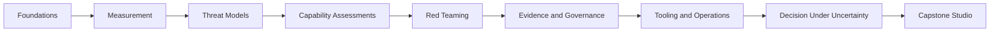
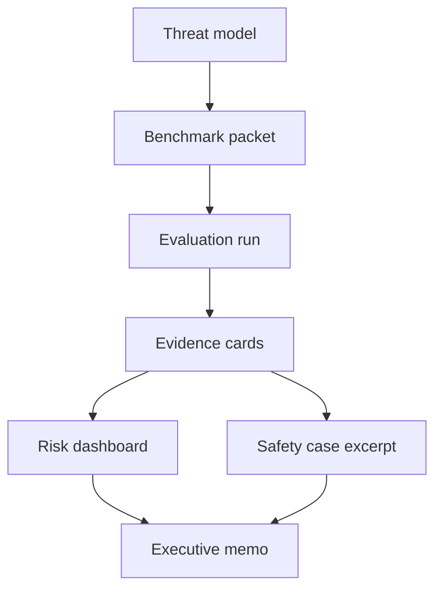

# Frontier Model Evaluation

## Executive summary

This specification designs a **51-hour interactive web course** called **“Frontier Model Evaluation”** for English-US learners, built to move a complete beginner toward **strong intermediate, expert-adjacent competence** in the workflows, evidence structures, decision logic, and reporting conventions used in frontier AI evaluation. The course is intentionally scoped around **evaluation method and judgment**, not around replacing deep wet-lab biosecurity expertise, advanced offensive-security expertise, or regulatory authority. That scoping matches the current field: NIST frames AI risk work around Govern, Map, Measure, and Manage; the EU AI Act imposes documentation, evaluation, serious-incident reporting, and cybersecurity duties for general-purpose AI models with systemic risk; FMF documents capability assessments as relative capability assessments, bottleneck assessments, and threat-simulation assessments; and AISI, OpenAI, Google DeepMind, Anthropic, Microsoft, Amazon, and Meta have all published framework material that links evaluation to deployment decisions. citeturn35search1turn35search2turn31view0turn31view1turn23view1turn23view3turn37view1turn37view2turn37view3turn6search9turn26search1turn27search1turn26search2

The course centers on the **actual frontier-evaluation lifecycle**: threat modeling, benchmark design, grader design, red teaming, safeguard evaluation, evidence capture, threshold interpretation, third-party assessment, and executive decision support. That lifecycle reflects current public guidance. FMF’s early best practices emphasize drawing on domain expertise and evaluating systems as well as models; AISI’s public updates report frontier evaluations across cyber, chemistry, biology, agency, and jailbreak robustness; and AISI’s Inspect framework operationalizes evaluations as datasets, solvers, scorers, tools, agents, and sandboxes. citeturn24search0turn37view1turn37view0

Pedagogically, the course is designed around **worked examples, active learning, retrieval practice, and authentic performance tasks** because those approaches consistently improve learning and retention compared with passive lecture alone. The resulting experience is not “watch a lesson, answer a quiz.” It is “read, inspect evidence, manipulate variables, defend a decision, and build portfolio-ready evaluation artifacts.” citeturn19search1turn19search7turn17search6turn18search14

The product specification is also **Figma-ready**. It assumes a **web-first** learning product made in **Figma Design + Figma Make + Figma AI + Figma Weave**, with **no NotebookLM**. That assumption is practical because Figma Make now supports prompt-to-app workflows, attached designs, conversation-based iteration, templates, preview-to-layers transfer, and publication, while Figma variables can power conditional logic, quiz state, progress, and simulation state. Figma also explicitly recommends front-loading prompts with task, context, key design elements, expected behaviors, and constraints, and warns that AI-assisted outputs should be verified rather than treated as authoritative facts. citeturn32view1turn32view2turn32view3turn32view0turn33view1

| Spec item | Recommendation |
|---|---|
| Course title | Frontier Model Evaluation |
| Promise | Zero → strong intermediate in frontier evaluation workflow, reporting, and decision-making |
| Audience | Safety researchers, policy-minded designers, PMs, ML engineers, auditors, governance fellows |
| Platform | Responsive web course, desktop-first |
| Primary build tools | Figma Design, Figma Make, Figma AI, Figma Weave |
| Course length | 51 hours total |
| Structure | 9 modules, 36 lessons |
| Core outputs | Threat model, benchmark packet, evidence cards, safeguard assessment, risk dashboard, safety case excerpt, executive memo |
| Primary source spine | NIST AI RMF, EU AI Act/GPAI Code, FMF technical reports, AISI materials, official lab frameworks, core evaluation papers |
| Accessibility target | WCAG 2.2 AA plus cognitive-accessibility supports |

## Course architecture

**Course promise.** By the end of the course, a learner should be able to scope a frontier-evaluation program, distinguish model-level from system-level risk, design a benchmark packet, choose sensible metrics and graders, run structured red-team and safeguard-evaluation workflows, interpret mixed evidence, and brief a ship/no-ship or mitigate/no-mitigate decision. The learner should also know where specialist domain expertise is required, which is a central norm in FMF guidance, NIST’s generative-AI profile, and AISI’s frontier-evaluation practice. citeturn24search0turn35search0turn37view1

**Target learner personas.**

| Persona | Starting point | Why this course fits |
|---|---|---|
| Policy-minded designer or PM | Understands product flows, not frontier evals | Needs structured thinking, reporting logic, and governance vocabulary |
| Early-career AI safety researcher | Reads papers, lacks operational workflow | Needs applied evaluation design, evidence management, and decision practice |
| ML engineer entering governance | Knows models, not regulators or auditors | Needs system framing, thresholds, residual-risk reasoning, and public documentation |
| External assessor / audit fellow | Understands governance, not evaluation mechanics | Needs concrete benchmark, red-team, and evidence-pack design skills |

**Prerequisites.** No formal prerequisites are required. Desirable but optional background includes basic ML vocabulary, comfort reading dashboards, and light familiarity with probability, ambiguity, and spreadsheet-style reasoning. Because official frameworks repeatedly emphasize expert consultation for high-risk domains, the course treats domain-biochem, offensive cyber, and autonomous-agent threat work as areas where learners must know when to escalate to SMEs rather than improvise. citeturn24search0turn23view1turn31view0

**Instructional pattern.** Every module uses the same learning rhythm:  
**Explain → show a worked example → let the learner manipulate a simplified artifact → test recall → run a decision simulation → debrief.** This pattern is evidence-based and fits Figma’s variable-driven prototyping model. citeturn19search1turn17search6turn18search14turn32view2



**Full 51-hour schedule.**

| Module | Lesson | Minutes | Lesson objective | Primary artifact or interaction |
|---|---|---:|---|---|
| Foundations | Why frontier model evaluation exists | 75 | Explain why frontier evaluation exists, who uses it, and what decisions it informs | Orientation map |
| Foundations | How frontier models are built and deployed | 75 | Distinguish training, tuning, scaffolding, deployment, and post-deployment monitoring | Lifecycle map |
| Foundations | Models, systems, scaffolds, and contexts | 90 | Separate model-level from system-level claims and deployment-context claims | Layered system diagram |
| Foundations | Evaluation program lifecycle | 90 | Trace the end-to-end workflow from threat model to executive report | Lifecycle reconstruction |
| Measurement | Benchmark anatomy | 75 | Identify the parts of a benchmark packet and why each matters | Benchmark dissection |
| Measurement | Metrics, pass/fail, and scorecards | 90 | Choose task-appropriate metrics and avoid misleading single-number summaries | Metric picker |
| Measurement | Human grading, LLM grading, adjudication | 90 | Compare grader approaches and specify adjudication rules | Grader calibration board |
| Measurement | Contamination, saturation, and canaries | 75 | Diagnose when benchmark improvements may not mean real capability gains | Leak-detection simulation |
| Threat models | Threat modeling basics | 75 | Build a simple misuse pathway with actor, target, capability, step, and defense | Threat tree |
| Threat models | Frontier harm domains overview | 75 | Contrast bio, cyber, autonomy, manipulation, and system misuse pathways | Domain map |
| Threat models | Bottlenecks, uplift, and misuse pathways | 90 | Explain how a model can remove bottlenecks or raise attack success | Uplift estimator |
| Threat models | Model risk, system risk, organizational risk | 90 | Separate technical, operational, and governance-level risk claims | Risk-layer canvas |
| Capability methods | Relative capability assessments | 90 | Use baseline models and comparison models responsibly | Comparison matrix |
| Capability methods | Bottleneck assessments | 90 | Translate expert bottlenecks into testable evaluation tasks | Bottleneck packet |
| Capability methods | Threat simulation assessments | 90 | Design a more realistic, proxy-to-real-world threat simulation | Scenario scaffold |
| Capability methods | Early-warning evaluations and forecasting | 90 | Use weak signals and trend lines to anticipate threshold crossings | Trend dashboard |
| Red teaming | Red-team goals, scope, and staffing | 90 | Scope a red-team campaign and define roles, rules, and outputs | Red-team plan |
| Red teaming | Jailbreaks, prompt injection, agents, tool misuse | 90 | Diagnose direct and indirect attacks in single-turn and agent settings | Attack-path exercise |
| Red teaming | Safeguard evaluations and safety-utility tradeoffs | 90 | Measure refusal robustness, false refusal, and mitigation quality | Tradeoff board |
| Red teaming | Security of evaluation environments | 90 | Explain why accesses, sandboxes, logs, and secrets matter in eval operations | Secure-run checklist |
| Evidence and governance | Evidence collection and traceability | 75 | Capture reproducible evidence linked to claims and decisions | Evidence cards |
| Evidence and governance | Model cards, system cards, transparency reports | 90 | Write public-facing and internal-facing documentation for an eval result | Draft report |
| Evidence and governance | Safety cases and structured arguments | 90 | Build a claim-evidence-warrant structure for deployment decisions | Safety-case excerpt |
| Evidence and governance | Third-party assessments and regulators | 75 | Specify what external assessors review and what gets reported | Third-party scope memo |
| Tooling and operations | Tooling landscape | 75 | Understand Inspect, HELM-like broad benchmarking, and custom eval harnesses | Tool map |
| Tooling and operations | Benchmark packet builder workshop | 75 | Build one benchmark packet from threat model to scoring plan | Packet draft |
| Tooling and operations | Evidence card builder workshop | 90 | Build clean evidence cards with metadata, provenance, and confidence | Evidence set |
| Tooling and operations | Dashboards, triage queues, and run ops | 90 | Prioritize runs, failures, and decision bottlenecks in an ops dashboard | Operations dashboard |
| Decision-making | Residual risk and thresholds | 90 | Interpret mixed evidence against thresholds and confidence bands | Threshold ladder |
| Decision-making | Executive decision reviews | 90 | Convert technical findings into governance-ready options and tradeoffs | Executive memo |
| Decision-making | Post-deployment monitoring and incidents | 90 | Define incident triggers, monitoring hooks, and update loops | Monitoring plan |
| Decision-making | Societal legitimacy and transparency | 90 | Weigh external trust, disclosure, and public-interest implications | Transparency brief |
| Capstone studio | Case simulation: cyber model near threshold | 90 | Handle ambiguous cyber evidence and decide what to escalate | Branching scenario |
| Capstone studio | Case simulation: bio model with mixed safeguards | 75 | Judge hazardous-capability signals with safeguard uncertainty | Branching scenario |
| Capstone studio | Capstone build sprint | 75 | Assemble all required artifacts into one coherent evaluation pack | Studio build |
| Capstone studio | Final review and defense | 90 | Defend methodology, evidence quality, and recommendation under critique | Oral defense |

**Total: 3,060 minutes = 51 hours**

## Knowledge system

**Core concept progression.** The concepts below are the minimum language and judgment scaffolding a learner needs before simulations feel meaningful. They are grounded primarily in NIST AI RMF, FMF capability-assessment guidance, AISI materials, the EU AI Act’s GPAI obligations, model-card/documentation literature, and public frontier-safety frameworks from major labs. citeturn35search1turn35search2turn23view1turn23view3turn37view0turn31view0turn31view1turn1search17turn22view0turn8search14turn8search11

| Concept | Beginner explanation | Intermediate explanation |
|---|---|---|
| Frontier model | A very advanced model near the edge of current capability | A model whose scale or capability may create severe public-safety or national-security concerns not handled by ordinary risk review |
| Model vs system | A model is the core AI; a system is the product around it | Evaluations must distinguish base-model behavior from system-layer behavior, scaffolds, tools, routing, guardrails, and deployment context |
| Deployment context | Where and how the AI is used | Risk changes with users, tools, permissions, latency, logging, rate limits, and whether outputs trigger real-world action |
| Threat model | A map of who could cause harm and how | A structured hypothesis linking actor, capability, pathway, target, constraints, and mitigations |
| Capability evaluation | A test of what the model can do | A measurement instrument whose evidentiary strength depends on design, validity, contamination control, and deployment relevance |
| Benchmark packet | A bundle of tasks, rubric, metadata, and thresholds | The operational unit of evaluation design, versioning, and review |
| Eval set | The specific test items used in a run | The concrete instantiation of a benchmark packet, often stratified by difficulty, domain, or attack path |
| Scorer / grader | The thing that decides if an answer is good | A formal scoring procedure that may be human, automated, model-based, or hybrid, with adjudication and audit trails |
| Inter-rater reliability | Whether graders agree | A quality signal for scoring stability; weak agreement means claims from the benchmark are fragile |
| Relative capability assessment | Compare a new model to a known baseline | Useful when a previously assessed model anchors inference, but risky when the baseline itself is weak or stale |
| Bottleneck assessment | Test if the model removes a key obstacle to harm | Domain experts identify “choke points”; the benchmark measures whether the model erodes them |
| Threat simulation assessment | Simulate a chunk of a real threat scenario | Stronger but costlier evidence because it approximates end-to-end misuse rather than isolated knowledge |
| Uplift | How much the model helps compared with not using it | Can be measured as time saved, success gained, expertise substituted, or barrier lowered for the attacker |
| Early-warning evaluation | A test that signals you are getting close to a dangerous threshold | A monitoring mechanism used before the strict threshold is crossed so mitigations can be prepared in time |
| Capability threshold | A line where more controls are triggered | A governance device, not a law of nature; it links measurement to mitigation or pause decisions |
| Contamination | The model saw test content during training or tuning | Contamination weakens claims that a score reflects generalization rather than memorization |
| Saturation | A benchmark becomes too easy to distinguish frontier systems | A saturated benchmark stops being decision-useful even if it once tracked progress well |
| Canary | A marker that helps detect benchmark leakage into training data | A contamination-control technique for protecting future evaluation validity |
| Jailbreak | A prompt that bypasses a model’s refusal or safeguard behavior | A class of adversarial tests that probes brittle alignment or weak refusal policies |
| Prompt injection | Malicious instructions smuggled through content the model reads | Especially important for tool-using systems because instructions and untrusted data share one channel |
| Agent scaffold | The extra tools and logic wrapped around a model | Tool use, planning loops, memory, browsing, code execution, and approvals can dramatically change risk |
| Safeguard | A measure intended to prevent harmful model behavior | Can live at the weight, prompt, classifier, access-control, workflow, or deployment layer |
| False refusal rate | How often the system wrongly refuses a benign request | A key measure in safeguard evaluation because safer is not always better if useful work is blocked |
| Residual risk | The risk that remains after mitigations | The actual decision variable for deployment review, not raw capability scores alone |
| Evidence card | A compact record of one important piece of evidence | A traceable claim-support unit with provenance, run metadata, grading outcome, confidence, and security level |
| Chain of custody | A record of where evidence came from and who touched it | Helps auditors trust that evidence was not silently edited, cherry-picked, or detached from context |
| Model card | Documentation about a model’s intended use, limitations, and evaluation | A structured transparency artifact, often necessary but not sufficient for frontier safety decisions |
| System card | Documentation about how a full product behaves in context | More decision-useful than a model card when multiple controls and tool flows shape risk |
| Safety case | A structured argument that a deployment is acceptably safe in context | A claim-evidence-warrant package that translates technical results into governance-ready reasoning |
| Third-party assessment | An outside review of capability claims or mitigations | FMF frames these as confirmation, robustness testing, or supplementation |
| Serious incident | A harmful event tied to model deployment or operation | Under the EU AI Act for GPAI models with systemic risk, incident tracking and reporting are formal obligations |
| Risk dashboard | The operational view of thresholds, trends, incidents, and open questions | A decision instrument that must show uncertainty, not just scores |

**Mental models.**

| Mental model | Use it to teach |
|---|---|
| Thermometer, not prophecy | An evaluation measures something real, but only what it is designed to measure |
| Safety case as legal brief | Claims require evidence and reasoning, not vibes |
| System over model | Product risk often lives in wrappers, tools, permissions, and defaults |
| Bottlenecks before catastrophes | Severe harms usually depend on a few high-leverage constraints |
| Early warning over cliff detection | Better to detect approach than wait for a threshold breach |
| Benchmark as measuring instrument | Decide what it measures, what it misses, and how it drifts |
| Red team as discovery engine | Adversarial testing finds unknown unknowns, not just pass/fail scores |
| Dashboard as decision compression | Executives need uncertainty, options, and consequences compressed into one view |
| Evidence card as atomic proof | Small, auditable pieces beat long, hand-wavy narratives |
| Residual risk as the real question | The point is not “Is the model powerful?” but “Is deployment acceptable now?” |

**Glossary.**

| Term | Working definition |
|---|---|
| Access control | Limits on who can access the model, tools, or logs |
| Adjudication | Resolving grader disagreement |
| Attack surface | The set of ways a model or system can be influenced or misused |
| Baseline model | The comparison model in a relative assessment |
| Calibration | Whether scores or confidence estimates line up with reality |
| Compliance rate | Share of harmful requests the model agrees to answer |
| Confidence interval | A range showing measurement uncertainty |
| Deployment mitigation | A control applied during product access or use |
| Exfiltration | Unauthorized theft of model weights or sensitive data |
| Gold standard | The desired answer or ground-truth judgment |
| Harm taxonomy | A classification of types of harm or misuse |
| Held-out set | Test content excluded from training or tuning |
| Human-in-the-loop | A design where people review or approve actions |
| Open weights | A release pattern where model parameters are made available |
| Operationalization | Turning an abstract risk into measurable variables |
| Out-of-distribution | Inputs different from what a model has seen before |
| Proxy metric | An indirect measurement that stands in for what you really care about |
| Red team | Adversarial evaluators trying to uncover failures |
| Replication | Re-running a test to see if a result holds |
| Sandboxing | Running tools or code in an isolated environment |
| Severity | How bad the impact would be if a failure happens |
| Signal vs noise | Distinguishing meaningful evidence from random variation |
| Systemic risk | Risk with unusually broad or severe spillover effects |
| Warrant | The reasoning that connects evidence to a claim |

## Interactive learning design

**Exercise catalog.** Every exercise is designed to become a native Figma interaction pattern: drag-and-drop, click-to-reveal, variable-based state switch, timeline reconstruction, evidence selection, or scenario branching. The exercise types mirror the field’s real tensions: sparse evidence, disagreement between graders, seductive benchmark wins, brittle safeguards, and ambiguous thresholds. The content is aligned to official practice documents and to public benchmark and safety-framework literature. citeturn35search0turn23view1turn23view3turn37view1turn32view2

| Exercise | Type | Goal | Est. time |
|---|---|---|---:|
| Risk sorter | Drag-and-drop | Sort examples into model, system, governance, or deployment risk | 15 min |
| Model/system decomposition | Layer map | Separate model behavior from wrappers, tools, and access controls | 20 min |
| Threat-tree builder | Click-to-add | Build actor → pathway → target → control logic | 25 min |
| Benchmark anatomy lab | Hotspot explainer | Identify sample source, rubric, scorer, threshold, and metadata | 15 min |
| Metric picker | Decision matrix | Match task type to metric family | 20 min |
| Confidence slider | Variable sim | See how uncertainty changes a recommendation | 10 min |
| Grader calibration | Side-by-side review | Compare human and automated grading outcomes | 20 min |
| Leakage detector | Evidence review | Spot contamination and saturation warning signs | 20 min |
| Canary puzzle | Text pattern search | Understand why eval secrecy and markers matter | 10 min |
| Bottleneck mapper | Scenario grid | Turn domain bottlenecks into candidate tasks | 25 min |
| Uplift estimator | Before/after sim | Estimate how much the model lowers attacker effort | 20 min |
| System-vs-model verdict | Multi-card compare | Decide which evidence supports model or system claims | 15 min |
| Jailbreak patch sprint | Iterative red-team loop | Improve safeguard prompts and policies across rounds | 25 min |
| Prompt-injection trace | Timeline reconstruction | Follow an indirect injection through tools and outputs | 20 min |
| False-refusal tuner | Tradeoff sim | Balance refusal robustness against benign usability | 20 min |
| Secure-run checklist | Toggle audit | Harden a sandboxed evaluation environment | 15 min |
| Evidence-card builder | Form + preview | Create one clean, traceable evidence card | 25 min |
| Benchmark packet builder | Multi-step wizard | Build a benchmark packet from a threat model | 30 min |
| Threshold court | Decision tree | Defend whether evidence justifies escalation | 25 min |
| Third-party assessor scoping | Branch planner | Decide what to externalize and why | 20 min |
| Incident timeline rebuild | Sequence sort | Reconstruct a serious incident from incomplete evidence | 20 min |
| Executive memo compression | Writing sprint | Turn technical detail into one-page decision support | 25 min |

**Scenario simulations.** These ten simulations are the backbone of the “expert-adjacent” part of the course because they force tradeoffs rather than memorization.

| Scenario | Setup | Branching outline |
|---|---|---|
| Cyber tutor near threshold | A new coding model performs better than baseline on realistic exploit tasks but still fails many long tasks | Node A: trust relative benchmark only / add threat simulation / pause for external review → Node B: mixed safeguard results / clear false-refusal problem / suspicious grader drift → Endings: release with controls / delay and harden / escalate to executive board |
| Bio assistant with strong knowledge | A model answers private chemistry and biology questions near expert level | Node A: interpret as dangerous capability / treat as insufficient proxy / request bottleneck analysis → Node B: open-weight release requested vs restricted API → Endings: restricted deployment / more SME review / no release |
| Agent browser exfiltration | Agent scaffold leaks a token in sandbox logs after an indirect instruction attack | Node A: blame model / blame system / classify as both → Node B: fix with prompt patch / tool approval / permission split → Endings: shallow fix rejected / system redesign / limited pilot |
| Benchmark jump too good to be true | Scores spike 18 points in one release cycle | Node A: celebrate improvement / investigate contamination / replicate on held-out packet → Node B: canary hit or no canary hit → Endings: rollback claim / partial confidence / validated improvement |
| Refusal model hurts benign users | A safeguard reduces harmful output but blocks hospital and school users too often | Node A: optimize for safety / optimize for utility / segment users by access path → Node B: add human appeal route or not → Endings: broad refusal remains / segmented release / redesign guardrails |
| External assessor disagreement | Third-party evaluators disagree with internal safety conclusions | Node A: treat as advisory / treat as blocking / replicate jointly → Node B: disagreement comes from different method or different threat model → Endings: revised claim / unchanged claim with rationale / pause for additional evidence |
| Serious incident report arrives | After deployment, a downstream provider reports a harmful misuse event | Node A: classify as reportable or not / investigate or dismiss / update model or system layer first → Node B: public transparency level high or low → Endings: report + mitigation / internal patch + watch / governance failure |
| Leaderboard pressure | Product leadership wants launch because public benchmarks look strong | Node A: emphasize benchmark wins / redirect to deployment-context risk / require dashboard with uncertainty → Node B: executive wants single score → Endings: poor decision from score fetish / nuanced release / delayed decision |
| Open-source release dilemma | Team wants open release but systemic-risk obligations may apply | Node A: argue benefits dominate / argue mitigations become too weak / stage release with stronger documentation → Node B: threshold notification and AI Office engagement early or late → Endings: no open release / staged release / compliance-heavy restricted release |
| Ship/no-ship board review | Evidence is mixed across cyber, autonomy, and safeguard tests | Node A: ship / ship with controls / do not ship → Node B: justify on residual risk, not raw scores → Endings: coherent defense / ungrounded optimism / over-conservative but defensible stop |

**Quiz bank.** The bank is intentionally split between **beginner recall** and **intermediate judgment**. It is grounded in the same source stack as the course: NIST AI RMF, FMF methods, AISI practice, EU GPAI obligations, and core benchmark/documentation papers. citeturn35search1turn23view1turn23view3turn37view1turn31view0turn8search14turn8search11

**Beginner questions.**

| Q | Answer | Feedback |
|---|---|---|
| What is the difference between a model and a system? | A model is the core AI; a system is the full product around it | Evaluating only the model can miss tool, wrapper, and access-control risk |
| Which NIST AI RMF function is most directly associated with testing and measurement? | Measure | But sound evaluation still depends on Govern, Map, and Manage too |
| What does a threat model describe? | Who could cause harm, how, and under what conditions | Treat it as the reason your evaluation exists |
| Why are frontier evaluations not just product QA? | They aim to assess severe or emerging risks with broader societal impact | The decision stakes are higher and uncertainty is larger |
| What is contamination? | Test data leaking into training or tuning | It can make scores look better than true generalization |
| What is saturation? | A benchmark becoming too easy to distinguish frontier systems | Saturated tests stop being useful for serious decisions |
| What does a canary help detect? | Benchmark leakage into training data | It protects future evaluation validity |
| What is a scorer? | A procedure for judging outputs | It can be human, automated, or hybrid |
| What is inter-rater reliability? | How consistently graders agree | Weak agreement means a benchmark may not support a strong claim |
| What is a bottleneck? | A key obstacle that prevents a harmful outcome | If a model removes it, risk may rise sharply |
| What does uplift mean? | How much the model improves an actor’s success or lowers effort | Uplift can matter more than raw knowledge alone |
| What is a relative capability assessment? | Comparing a new model to a known baseline | It is useful but weaker than direct real-world evidence |
| What is a threat simulation? | A test that approximates a chunk of a real harmful scenario | It tends to be more realistic but more expensive |
| What is a jailbreak? | A prompt that bypasses refusal behavior | Jailbreak resistance is not the same as true safety |
| What is prompt injection? | Untrusted content altering model behavior | It is especially dangerous in agentic or tool-using systems |
| What is residual risk? | Risk remaining after mitigations | Deployment decisions should focus on this, not raw scores alone |
| What is an evidence card? | A traceable record of one meaningful result | Small, auditable units improve reporting quality |
| What is a model card? | Documentation about a model’s intended use and limits | It helps transparency but is not enough by itself |
| What is a system card? | Documentation for a full product in context | Often more useful than a model card for deployment decisions |
| What is a safety case? | A structured argument supported by evidence | It connects measurements to decisions |
| Why might you need third-party assessors? | To confirm, challenge, or supplement internal work | External perspectives can strengthen robustness |
| What is a false refusal? | A benign request wrongly blocked by safeguards | Safer-looking systems can still fail users badly |
| Why does deployment context matter? | The same model can be riskier or safer depending on tools and users | Context changes harm pathways |
| Why should evaluations be versioned? | Because tasks, rubrics, models, and thresholds evolve | Unversioned results are hard to interpret later |
| What is a threshold? | A decision line that triggers extra controls | It is a governance instrument, not a natural constant |
| Why do dashboards need uncertainty? | Because single scores can hide fragile evidence | Good governance needs confidence, not theater |

**Intermediate questions.**

| Q | Answer | Feedback |
|---|---|---|
| A model improves sharply on one public benchmark but not on private held-out tasks. What is the most likely interpretation? | Possible contamination, benchmark overfitting, or saturation | Treat public-benchmark wins cautiously unless held-out evidence supports them |
| When is a relative capability assessment most useful? | When a previously assessed baseline is close in domain, task, and deployment relevance | Similarity matters; stale or weak baselines mislead |
| Why can threat simulations provide stronger evidence than MCQs? | They test integrated task performance closer to real misuse pathways | More realism often means stronger but costlier evidence |
| Why is “system over model” a useful rule in product evaluation? | Because wrappers, tools, and permissions often determine actual risk | High-risk failures can emerge from composition, not just weights |
| What is the main governance risk of using LLM graders without calibration? | You may automate bias or inconsistency and mistake it for rigor | Always calibrate and spot-check |
| Why might a strong refusal model still be unsafe? | It may fail under indirect attacks, tool misuse, or segmented prompts | Surface-level refusals do not guarantee robust safeguards |
| What is the point of an early-warning evaluation? | To detect approach to a dangerous threshold before crossing it | Governance works better when it acts early |
| Why should high-risk benchmarks involve SMEs? | Because poor task specification breaks the link between test and real-world risk | Domain realism is not optional in frontier work |
| What does “residual risk acceptable for this deployment” mean? | The remaining risk, after controls, is judged tolerable in the given context | Context and mitigations matter as much as capability |
| What is the best response to disagreement between internal and third-party assessors? | Compare methods, threat models, and assumptions; then replicate if needed | Do not reduce disagreement to politics alone |
| Why can open release complicate mitigation? | Because downstream actors can bypass or remove deployment-layer controls | Open release changes what safeguards are feasible |
| Why is a serious incident report valuable even if rare? | It reveals real-world failure pathways theoretical evals may miss | Post-deployment evidence should update the program |
| If a safeguard improves harmful-request blocking but doubles false refusals, what should you do next? | Run a safety-utility tradeoff review, segment use cases, and redesign if needed | Refusal rate alone is not success |
| Why is chain of custody important for evidence cards? | It preserves trust that evidence matches the run and was not selectively edited | Auditability matters in contentious decisions |
| What is the value of a benchmark packet over a loose pile of prompts? | It standardizes source, rubric, metrics, versioning, and threshold logic | Reuse and audit both improve |
| Why are “capable” and “deployable” different questions? | Capability is about what the model can do; deployability is about whether the risk is acceptable in context | Deployment is a socio-technical judgment |
| What is the most common mistake with dashboards? | Showing clean scores without assumptions, uncertainty, or evidence links | Pretty dashboards can produce bad decisions |
| How should a board react to mixed evidence near a threshold? | Ask what uncertainties remain, what mitigations exist, and what additional evidence would change the decision | Mixed evidence often warrants staged release or pause |
| What is the strongest reason to evaluate systems as well as models? | The system is what users and attackers actually interact with | Product reality beats lab abstraction |
| Why link evidence cards to claims instead of filing them separately? | Because decisions are made on claims, and evidence must directly support or weaken them | This reduces narrative drift |
| What would make a benchmark packet unfit for use? | Weak task validity, poor grading, unclear thresholds, or likely contamination | The packet must be decision-relevant, not just clever |
| Why can agent scaffolds raise risk even if the base model seems similar? | They add planning loops, tools, and longer action chains | Tool use changes capability profile |
| What is a good reason to trigger external review before launch? | Novel capabilities, mixed internal evidence, or highly specialized risk domains | External review is especially useful when stakes or uncertainty are high |
| Why are public transparency artifacts still limited? | They cannot reveal everything without creating security or misuse problems | Transparency must be balanced against operational safety |
| What is the best short definition of a safety case? | A structured, evidence-backed argument that a deployment is acceptably safe in context | It is meant to support judgment, not replace it |
| Why should the capstone require an executive memo, not only technical artifacts? | Because real deployment decisions are made across technical and governance audiences | Communication is part of evaluation competence |

**Capstone brief.** The capstone asks the learner to act as the **evaluation lead for a frontier model preparing for staged deployment**. The learner receives a partially complete packet with mixed results in cyber, limited bio-proxy signals, ambiguous jailbreak robustness, and conflicting internal/external interpretations. The goal is to produce a **single coherent evaluation record** that a safety lead, product lead, government liaison, or external assessor could actually use.

**Required artifacts.**

| Artifact | What it proves |
|---|---|
| Threat model | The learner can scope actors, pathways, domains, and constraints |
| Benchmark packet | The learner can turn threat logic into test design |
| Evidence-card set | The learner can capture and trace results cleanly |
| Safeguard assessment memo | The learner can analyze safety-utility tradeoffs |
| Risk dashboard | The learner can communicate threshold status and uncertainty |
| Safety-case excerpt | The learner can connect evidence to a deployment argument |
| Executive memo | The learner can translate technical evidence into decision options |

**Capstone deliverables vs grading rubric.**

| Deliverable | Rubric dimension | Weight | What excellent looks like |
|---|---|---:|---|
| Threat model | Domain framing | 15% | Pathway is realistic, bounded, and clearly linked to evaluation choices |
| Benchmark packet | Method quality | 15% | Tasks, scorers, thresholds, and contamination controls are coherent |
| Evidence cards | Traceability | 15% | Every key claim has linked evidence with provenance and confidence |
| Safeguard memo | Tradeoff judgment | 10% | Distinguishes refusal robustness from false refusal and residual risk |
| Risk dashboard | Decision usability | 10% | Shows thresholds, uncertainty, open questions, and recommended next steps |
| Safety-case excerpt | Argument quality | 15% | Claims, evidence, and warrants align with a deployment context |
| Executive memo | Communication | 10% | Clear options, implications, and recommendations for nontechnical reviewers |
| Final defense | Professional reasoning | 10% | Defends choices under critique without overclaiming certainty |

**Overall assessment rubric.**

| Level | Description |
|---|---|
| Emerging | Understands vocabulary but produces fragile or un-auditable evaluation artifacts |
| Developing | Produces coherent artifacts but struggles with uncertainty, thresholds, or system-vs-model distinctions |
| Proficient | Produces decision-useful artifacts with traceability, realistic tradeoff reasoning, and clear escalation logic |
| Strong intermediate | Produces robust, governance-ready artifacts and can defend them under adversarial review |
| Expert-adjacent | Demonstrates operational judgment, communication fluency, and disciplined uncertainty handling, while still escalating SME-dependent domains appropriately |

**Success metrics for the live course.**

| Metric | Target |
|---|---|
| Completion rate | 70% or higher |
| Pre/post knowledge gain | +25 percentage points median |
| Simulation completion | 85% of learners finish all 10 scenarios |
| Capstone pass rate | 75% score 80/100 or above |
| Artifact completeness | 90% of capstones contain all required artifacts |
| Dashboard readability score | 4.2/5 average learner rating |
| Accessibility satisfaction | 4.3/5 average across keyboard, caption, contrast, and motion controls |

## Figma-ready product specification

**Brand position.** The visual language should feel like a cross between a **research operations console**, a **government-grade evidence system**, and an **editorial learning environment**. It should look serious without becoming cold, and should signal that the learner is doing consequential work. The right tone is **evidence-first, mission-critical, public-interest, and technically literate**.

**Brand kit and token system.** Use tokens because Figma variables and modes make the system easier to scale, theme, and prototype interactively. Also keep accessibility explicit: WCAG 2.2 should govern color contrast, focus visibility, error handling, pointer alternatives, and reduced-motion support, while cognitive-accessibility guidance supports clear structure, predictable navigation, plain labels, and progressive disclosure. citeturn32view2turn32view3turn15search0turn15search1turn15search17

| Token family | Token | Value | Use |
|---|---|---|---|
| Color | `bg.canvas` | `#0A1220` | App background |
| Color | `bg.surface` | `#0F172A` | Panels |
| Color | `bg.surface.raised` | `#142033` | Cards, modals |
| Color | `bg.subtle` | `#E2E8F0` | Light reading mode sections |
| Color | `text.primary.dark` | `#F8FAFC` | Primary text on dark |
| Color | `text.secondary.dark` | `#CBD5E1` | Secondary text on dark |
| Color | `text.primary.light` | `#0F172A` | Primary text on light |
| Color | `accent.info` | `#38BDF8` | Information, links |
| Color | `accent.signal` | `#22D3EE` | Progress, active state |
| Color | `accent.success` | `#10B981` | Passed, acceptable |
| Color | `accent.warning` | `#F59E0B` | Caution, review |
| Color | `accent.critical` | `#F43F5E` | High severity, blocked |
| Color | `accent.analysis` | `#8B5CF6` | Research mode, evidence overlays |
| Typography | `font.ui` | Inter Variable | UI, body, tables |
| Typography | `font.display` | IBM Plex Sans | Headlines and module titles |
| Typography | `font.mono` | IBM Plex Mono | Scores, evidence IDs, code/logs |
| Type scale | `display.xl` | 64/72, 700 | Hero title |
| Type scale | `display.lg` | 48/56, 700 | Module title |
| Type scale | `heading.md` | 32/40, 650 | Lesson title |
| Type scale | `heading.sm` | 24/32, 650 | Section label |
| Type scale | `body.lg` | 18/28, 400 | Main reading mode |
| Type scale | `body.md` | 16/24, 400 | Standard body |
| Type scale | `body.sm` | 14/20, 400 | Support text |
| Type scale | `label` | 12/16, 600 | Chips, metadata |
| Spacing | `space.1`–`space.10` | 4, 8, 12, 16, 24, 32, 40, 48, 64, 96 | Layout system |
| Radii | `radius.none`–`radius.pill` | 0, 6, 10, 14, 20, 999 | Panels, controls |
| Elevation | `e0`–`e3` | none / subtle / medium / high | Layering system |
| Motion | `motion.fast` | 120ms | Small state changes |
| Motion | `motion.base` | 180ms | Tabs, accordions |
| Motion | `motion.slow` | 240ms | Scene changes |
| Motion | `motion.reduce` | true | Reduced-motion mode removes parallax and nonessential animation |

**Screen inventory.**

| Screen name | Purpose |
|---|---|
| Course home | Orientation, promise, progress |
| Diagnostic entry | Pre-assessment and learner routing |
| Module map | 9-module overview with unlock logic |
| Lesson shell | Reading + worked example + exercise + quiz |
| Concept atlas | Searchable concept cards |
| Glossary drawer | In-context definitions |
| Evidence lab | Evidence-card review and builder |
| Benchmark lab | Benchmark-packet builder |
| Threat model canvas | Actor-pathway-control mapping |
| Grader calibration | Human vs LLM scoring comparison |
| Dashboard view | Thresholds, incidents, trends, open questions |
| Simulation hub | Entry point for 10 branching scenarios |
| Scenario player | Branch-by-branch decision engine |
| Timeline reconstruction | Incident or attack-path replay |
| Decision review | Recommendation + rationale compare |
| Capstone studio | Assemble final deliverables |
| Capstone defense view | Present and defend artifacts |
| Accessibility settings | Contrast, type size, motion, narration |
| Completion screen | Reflection, certificate, export |
| Admin/instructor view | Progress, rubric, artifact submissions |

**Component inventory.**

| Component | Purpose | Variants |
|---|---|---|
| App shell | Main frame and nav | default, condensed, reading mode |
| Top navigation | Global navigation | default, lesson, capstone |
| Module rail | Module progress and jump nav | collapsed, expanded |
| Lesson header | Title, metadata, time, objectives | standard, compact |
| Progress tracker | Track lesson and module completion | linear, segmented |
| Concept card | Core concept presentation | beginner, intermediate, compare |
| Callout panel | Highlight caution, insight, method note | info, warning, critical, success |
| Evidence card | Atomic proof object | raw, reviewed, disputed, approved |
| Benchmark card | Benchmark packet summary | draft, validated, deprecated |
| Metric tile | KPI display | info, threshold, alert |
| Threshold bar | Show risk level vs threshold | safe, caution, blocked |
| Scenario node | Branching choice item | neutral, selected, locked |
| Decision chip | Option tagging | ship, delay, escalate, mitigate |
| Drag tray | Draggable tokens for exercises | default, disabled |
| Timeline lane | Attack path or incident path | event, decision, evidence |
| Grader pane | Compare scores and comments | human, llm, fused |
| Quiz item | Question and answer interaction | mcq, multi-select, confidence slider |
| Rubric row | Criterion scoring | numeric, descriptive |
| Dashboard chart card | Trend or comparison | line, bar, stacked, table |
| Side drawer | Glossary, notes, evidence details | glossary, notes, evidence |
| Modal | Confirmations and warnings | standard, destructive |
| Toast | System feedback | success, error, warning |
| Data table row | Evidence or benchmark list rows | clean, flagged, selected |
| Accessibility toggle group | Personalization controls | contrast, type, motion, narration |

**Sample UI copy for key screens.**

| Screen | Sample copy |
|---|---|
| Course home | “Evaluation is where frontier AI becomes legible. In this course, you will learn to turn capability signals into deployable judgment.” |
| Lesson shell | “Today’s question: Does this score actually support the claim being made?” |
| Evidence card | “Claim support: Moderate. Confidence: 0.71. Reason for caution: scorer disagreement on 3 of 12 samples.” |
| Benchmark lab | “A benchmark packet is not a prompt folder. It is a measurement instrument.” |
| Risk dashboard | “Threshold status: Not crossed. Early-warning status: Active. Open question: Is this uplift signal real or contaminated?” |
| Scenario player | “You do not have enough evidence to be certain. You do have enough evidence to choose your next action.” |
| Capstone studio | “Assemble the smallest complete case that an external assessor could audit without you in the room.” |
| Completion screen | “You have finished the course. You have not learned certainty; you have learned disciplined judgment.” |

**Data model for evidence cards.**

| Field | Type | Required | Notes |
|---|---|---|---|
| `evidence_id` | string | yes | Stable ID |
| `claim_id` | string | yes | Claim the evidence supports or weakens |
| `title` | string | yes | Human-readable label |
| `run_id` | string | yes | Evaluation run identifier |
| `model_id` | string | yes | Model/version tested |
| `system_id` | string | no | Product/system wrapper if relevant |
| `domain` | enum | yes | cyber, bio, autonomy, manipulation, general |
| `method` | enum | yes | relative, bottleneck, threat-sim, red-team, safeguard, incident |
| `sample_refs` | array | yes | Linked task/sample IDs |
| `prompt_excerpt` | text | no | Safe excerpt only |
| `response_excerpt` | text | no | Safe excerpt only |
| `score` | number/string | yes | Scalar or categorical |
| `grader` | string | yes | Human/LLM/hybrid |
| `confidence` | number | yes | 0–1 |
| `severity` | enum | yes | low, medium, high, critical |
| `status` | enum | yes | raw, reviewed, disputed, approved |
| `provenance` | object | yes | Time, author, source, chain-of-custody metadata |
| `attachments` | array | no | Logs, screenshots, traces |
| `access_level` | enum | yes | internal, restricted, regulator-shareable |
| `notes` | text | no | Context, caveats, replicate status |

**Data model for benchmark packets.**

| Field | Type | Required | Notes |
|---|---|---|---|
| `benchmark_id` | string | yes | Stable versioned ID |
| `title` | string | yes | Benchmark name |
| `threat_model_ref` | string | yes | Linked threat model |
| `assessment_type` | enum | yes | relative, bottleneck, threat-sim |
| `domain` | enum | yes | cyber, bio, autonomy, manipulation, general |
| `hypothesis` | text | yes | What this packet is trying to measure |
| `task_format` | enum | yes | mcq, freeform, agent task, rubric essay, coding |
| `sample_count` | int | yes | Total items |
| `difficulty_bands` | array | no | easy/med/hard or equivalent |
| `gold_standard` | text/object | yes | Correct answer or grading guidance |
| `scoring_method` | text | yes | Human, automated, hybrid |
| `threshold_rule` | text | yes | What outcome triggers concern |
| `contamination_controls` | text | yes | Canary, held-out, private set, rewrite strategy |
| `sme_signoff` | bool/string | no | Domain-reviewer metadata |
| `version` | string | yes | Version tag |
| `status` | enum | yes | draft, validated, deprecated |



**Visual diagram specifications.**

| Diagram | Format | Spec |
|---|---|---|
| Course flow map | Mermaid | 9 modules in sequence with loopbacks from simulations to concept atlas |
| Threat-model tree | Node map | Actor → motive → pathway → capability → target → control |
| Model/system stack | Layered diagram | Base model, scaffold, tools, policy layer, product UI, monitoring layer |
| Benchmark packet anatomy | Exploded diagram | Threat link, samples, rubric, scorer, controls, threshold |
| Capability-assessment taxonomy | Comparison grid | Relative vs bottleneck vs threat simulation |
| Safeguard attack surface map | Network diagram | User prompt, retrieved content, tool outputs, memory, approvals |
| Evidence-card lifecycle | State diagram | Raw → reviewed → disputed → approved |
| Threshold ladder | Gauge diagram | below threshold, watch, early warning, blocked, escalated |
| Dashboard information architecture | Map | KPI row, evidence table, incident panel, trend charts, open questions |
| Capstone artifact relationship | Mermaid | Threat model → benchmark → evidence → dashboard → memo |

**Accessibility and inclusion notes.** The course should conform to **WCAG 2.2 AA**, use color plus shape/icon/text for status, support full keyboard navigation, offer captions and transcripts for every animated or narrated element, provide a reduced-motion mode, and include plain-language alternates for dense technical text. Because cognitive accessibility is not solved by contrast alone, include predictable navigation, short labels, layered disclosure, “novice mode” explanations, and saved reading preferences. citeturn15search0turn15search1turn15search4turn15search6

## Implementation roadmap

**Prioritized source list.** These are the sources that should anchor course copy, artifact language, simulation logic, and glossary choices.

| Priority | Source | Why it matters |
|---|---|---|
| Essential | NIST AI RMF 1.0 and Playbook | Core risk-management vocabulary and lifecycle framing citeturn35search1turn35search2 |
| Essential | NIST GenAI Profile | Practical GenAI-specific risk framing and red-team relevance citeturn35search0turn35search3 |
| Essential | EU AI Act GPAI Q&A, guidelines, and GPAI Code | Current obligations for evals, incidents, and cybersecurity for systemic-risk GPAI citeturn31view0turn31view1turn31view2 |
| Essential | FMF Early Best Practices, Frontier Capability Assessments, Third-Party Assessments | Shared field vocabulary and assessment taxonomy citeturn24search0turn23view1turn23view3 |
| Essential | AISI Research Agenda, May evaluation update, Inspect docs, safety-case work | Operational examples, tools, and structured safety reasoning citeturn29search9turn37view1turn37view0turn22view0 |
| Essential | Official frontier frameworks from OpenAI, Google DeepMind, Anthropic, Microsoft, Amazon, Meta | Public examples of thresholded frontier-governance logic citeturn37view2turn37view3turn6search9turn26search1turn27search1turn26search2 |
| Important | HELM, BIG-bench, RE-Bench, WMDP, CyberSecEval | Benchmark examples spanning breadth, difficulty, real-world tasks, hazardous knowledge, and cyber risk citeturn9search9turn9search10turn28search2turn28search6turn28search1turn28search10 |
| Important | Model Cards, System Cards, Datasheets | Documentation patterns for transparency artifacts citeturn8search14turn8search11turn8search2 |
| Important | Benchmark contamination and saturation literature | Guards against false confidence from public benchmark jumps citeturn10search2turn10search1turn20search6 |
| Important | Prompt injection and secure AI development guidance | Necessary for modern system-level evaluation and agent-tool risk citeturn12search0turn12search3turn13search3turn12search11 |
| Important | METR long-task and real-world studies | Reminds learners that benchmark gains and real-world usefulness can diverge citeturn14search2turn14search5turn9news32 |
| Build-specific | Figma Make, Figma AI, Figma variables, Figma Weave docs | Current product capabilities and prompt constraints citeturn32view1turn32view2turn32view3turn32view0turn33view0turn33view1turn34search2turn34search3turn34search5 |

**Six-week Figma implementation schedule.**

| Week | Build goal | Figma output |
|---|---|---|
| Week one | Lock curriculum architecture, brand kit, and data models | Design-system file, token library, IA map, content schema |
| Week two | Build course shell and golden lesson | Lesson shell, module map, concept card, quiz components |
| Week three | Build labs and artifact builders | Evidence-card builder, benchmark-packet builder, glossary drawer |
| Week four | Build scenario engine and dashboard views | Simulation player, decision nodes, threshold dashboard |
| Week five | Build capstone studio and instructor/admin layers | Capstone workspace, rubric views, submission states |
| Week six | Accessibility pass, content loading, QA, and publishing workflow | High-fidelity prototype, reduced-motion mode, published Make prototype, exportable design layers |

**Figma build strategy.** Use **Figma Make** for the clickable course shell, scenario logic, dashboard behaviors, and artifact-builder interactions; use **Figma AI / First Draft / agent** for fast layout generation and content rewrites on standard web patterns; use **Figma Weave** for hero visuals, module artwork, background textures, diagram-polish assets, and visual storytelling. This division matches product strengths: Figma Make is a prompt-to-app tool for functional prototypes and attached design flows; Figma AI’s First Draft is strongest on common web/mobile patterns and should not be trusted for niche logic without review; Figma Weave is a node-based canvas for imagery, video, audio, and scalable creative workflows. citeturn32view1turn32view0turn33view0turn33view1turn34search2turn34search3turn34search5

**Prompt pack.** The prompts below are intentionally front-loaded with task, context, design elements, behaviors, and constraints, because Figma itself recommends that pattern for better Make results. citeturn32view0

**Design system — Figma Make**
```text
Build a responsive desktop-first web design system for an interactive course called “Frontier Model Evaluation.” Tone: mission-critical, evidence-first, public-interest, technically literate. Use these tokens: dark canvas, raised data panels, cyan info, emerald success, amber warning, rose critical, violet analysis. Typography: Inter Variable for body, IBM Plex Sans for headings, IBM Plex Mono for evidence IDs and metrics. Create a style guide page plus reusable components for app shell, lesson header, concept card, evidence card, benchmark card, metric tile, threshold bar, scenario node, decision chip, quiz item, glossary drawer, dashboard chart card, rubric row, and modal. Include light and dark modes, reduced-motion mode, high-contrast mode, and keyboard focus states. Use 8-point spacing logic and clear token naming. Output should be editable, consistent, and ready to power a course product.
```

**Design system — Figma AI**
```text
Generate a desktop web UI style guide for a serious education platform focused on AI safety evaluation. Include a type scale, color swatches, spacing tokens, radii, shadows, button states, form fields, cards, badges, tabs, and tables. Visual style: research operations dashboard meets editorial learning product. Keep layout simple, modular, and easy to restyle manually. Avoid playful illustration styles. Prioritize readability, contrast, and dense-but-clear information patterns.
```

**Design system — Figma Weave**
```text
Create a design-system visual pack for a frontier AI evaluation course. Deliver abstract but legible visual language assets: layered grid textures, signal-wave backgrounds, subtle node-and-graph motifs, threshold ladder icons, evidence-tag icon set, alert-state textures, and a restrained color mood board based on dark navy, ice cyan, safety amber, critical rose, and analysis violet. Style should feel like a secure research console, not cyberpunk spectacle. Export assets suitable for hero banners, empty states, dividers, and module title cards.
```

**Course shell — Figma Make**
```text
Build the main course shell for “Frontier Model Evaluation” as a responsive web app. Required screens: course home, module map, lesson shell, glossary drawer, simulation hub, capstone studio, and completion screen. Add left-side module rail, top nav, persistent progress tracker, and a right-side context drawer that can switch between glossary, notes, and evidence details. Lesson shell must support: title, estimated time, learning objectives, long-form reading area, worked example panel, interactive exercise panel, knowledge check, and lesson-end summary. Include desktop-first layout at 1440px and tablet behavior at 1024px. Interactions: module progress, expand/collapse glossary, mark lesson complete, save notes locally, and open evidence references inline. Keep copy realistic and aligned to AI safety vocabulary.
```

**Course shell — Figma AI**
```text
Generate a web learning platform homepage and lesson page for an advanced technical course. Include sidebar navigation, progress bars, long-form reading layout, embedded activity cards, and strong information hierarchy. Make it feel like a policy-plus-research product rather than a consumer course marketplace. Use clean, serious visual rhythm and leave room for charts and evidence artifacts.
```

**Course shell — Figma Weave**
```text
Create hero and module-banner visuals for a course titled “Frontier Model Evaluation.” Produce one main 16:9 hero image and nine related banner treatments. Visual idea: structured grids, layered dossiers, threshold markers, abstract node networks, and controlled signal flows. The imagery should suggest evaluation, evidence, governance, and infrastructure. Avoid robots, faces, or glowing brains. Keep composition spacious enough for headline overlays.
```

**Golden lesson — Figma Make**
```text
Build one fully interactive “golden lesson” called “What a Frontier Evaluation Actually Measures.” The lesson should demonstrate the full pattern used across the course: opening hook, concept card rail, worked example comparing model vs system claims, drag-and-drop risk-sorting exercise, inline glossary definitions, 4-question quiz with instant feedback, and a closing decision checkpoint. Include progress states, completion state, and a tutor-style side panel with hints. Add variables so the learner can toggle between beginner explanation and intermediate explanation for each concept. Use sample concepts: threat model, benchmark packet, residual risk, and safety case.
```

**Golden lesson — Figma AI**
```text
Generate a lesson page for a technical course that includes a hero statement, lesson objective panel, long-form content blocks, callout cards, one worked example area, one interactive exercise placeholder, and a short quiz section. Tone: expert, calm, and precise. Focus on readability and modularity.
```

**Golden lesson — Figma Weave**
```text
Create supporting visuals for a lesson on measurement and evaluation. Deliver one editorial illustration, three data-texture backgrounds, and a set of small motif assets that visually represent comparison, thresholds, evidence linking, and uncertainty. Keep everything abstract, diagram-friendly, and suitable for overlay with text.
```

**Simulation template — Figma Make**
```text
Build a reusable branching-scenario template for frontier AI evaluation decisions. The template should include: scenario intro, context card, evidence stack, decision node, three branching options, consequence panel, updated dashboard snapshot, and debrief. Add variables to track learner choices, confidence rating, and whether the learner requested more evidence, external review, or mitigation. Include progress breadcrumbs so users can see how they reached an ending. Design for 10 scenarios with reusable components. The UI should feel like an incident room crossed with a policy briefing interface.
```

**Simulation template — Figma AI**
```text
Generate a branching decision-flow screen for a serious web application. Include a scenario statement, stacked evidence cards, primary decision buttons, consequence preview, and a compact progress path. Keep the layout suitable for complex text and repeated use.
```

**Simulation template — Figma Weave**
```text
Create a visual asset pack for branching simulations: neutral background scenes, subtle path-line graphics, branching-arrow overlays, consequence-state textures, and decision-state badges for ship, delay, escalate, mitigate, and investigate. Keep the style restrained and analytical.
```

**Evidence card builder — Figma Make**
```text
Build an evidence-card builder interface for the course. Fields: evidence ID, linked claim, run ID, model ID, system ID, domain, method, sample references, score, grader type, severity, confidence, status, provenance, access level, and notes. The form should live on the left with a real-time formatted evidence card preview on the right. Include validation, status chips, severity color coding, confidence indicator, and an export-ready compact card layout. Add a mini-library of example evidence cards: one strong, one disputed, one noisy, and one incomplete.
```

**Evidence card builder — Figma AI**
```text
Generate a structured form-and-preview workflow for documenting evaluation evidence in a technical governance product. Use a split layout with editable fields on one side and a polished record card preview on the other. Emphasize metadata, confidence, provenance, and review status.
```

**Evidence card builder — Figma Weave**
```text
Create a visual token and icon pack for evidence records: provenance stamp, confidence gauge motif, disputed-state mark, reviewed-state seal, restricted-access badge, and small textures for high, medium, and low confidence. Style: minimal, institutional, precise.
```

**Benchmark packet builder — Figma Make**
```text
Build a benchmark-packet builder wizard with five steps: threat model link, hypothesis, task format and sample plan, scoring method and gold standard, contamination controls and threshold rule. Add a packet preview panel that updates live and shows a clean one-page benchmark summary. Include helper text explaining relative assessments, bottleneck assessments, and threat simulations. Make the interaction feel like assembling a measurement instrument, not filling a generic form.
```

**Benchmark packet builder — Figma AI**
```text
Generate a multi-step web form for creating a structured benchmark or evaluation packet. Include step navigation, concise helper text, review summary, and clear grouping of fields. Visual style should support dense expert content without becoming cluttered.
```

**Benchmark packet builder — Figma Weave**
```text
Create supporting visuals for a benchmark-builder experience: abstract measurement diagrams, packet cover motifs, subtle rubric-grid textures, and small iconography for task type, scoring, threshold, contamination control, and SME review.
```

**Risk dashboard — Figma Make**
```text
Build a risk dashboard for frontier model evaluation. Required modules: threshold status bar, KPI tiles, trend chart, evidence queue, incident watch panel, open-questions panel, and action recommendations. Add filters for domain, model version, assessment type, and severity. Include one dashboard state below threshold, one early-warning state, and one blocked/escalated state. Every major chart or tile should link to underlying evidence-card detail. The dashboard must display uncertainty explicitly with confidence bands, notes, or caution chips.
```

**Risk dashboard — Figma AI**
```text
Generate a desktop dashboard for a high-stakes technical governance product. Include threshold indicators, trend charts, incident summaries, status chips, and a table of linked evidence. Keep it sober, legible, and heavy on hierarchy rather than decoration.
```

**Risk dashboard — Figma Weave**
```text
Create a dashboard visual pack: threshold gauge motifs, signal-line chart textures, caution-state overlays, and minimal abstract backgrounds that can sit behind charts without harming readability. No flashy neon; keep it formal and information-safe.
```

**Capstone studio — Figma Make**
```text
Build a capstone studio where learners assemble final deliverables for a frontier evaluation review. Required panes: threat model, benchmark packet, evidence-card library, safeguard memo, dashboard snapshot, safety-case excerpt, executive memo, and rubric sidebar. Add drag-to-attach interactions so evidence cards can be linked to claims and dashboard modules. Include submission state, peer-review state, instructor-review state, and final defense presentation mode. The studio should feel like preparing a real review package for a mixed technical-governance audience.
```

**Capstone studio — Figma AI**
```text
Generate a complex workspace UI for assembling multiple related deliverables in a professional learning product. Include document tabs, side review panel, status indicators, and a presentation-ready mode. Optimize for structured, serious work rather than casual collaboration.
```

**Capstone studio — Figma Weave**
```text
Create final-presentation visuals for the capstone studio: title-slide background, evidence-wall texture, review-board visual motif, and a restrained pack of presentation dividers for threat model, benchmark packet, evidence, dashboard, safety case, and recommendation.
```

**Hero and module visuals — Figma Make**
```text
Create a responsive course marketing and onboarding screen with a strong hero, module cards, trust signals, course outcomes, and a short explanation of why frontier evaluations matter. Use the course design system and integrate the hero image area so it can later receive custom visuals from Figma Weave.
```

**Hero and module visuals — Figma AI**
```text
Generate a clean course landing page for a serious technical program. Include hero section, learning outcomes, module previews, instructorless trust framing, and CTA areas. Avoid consumer-edtech clichés. Make it feel like a research-grade public-interest course.
```

**Hero and module visuals — Figma Weave**
```text
Create the definitive visual suite for the course: one hero visual, nine module title cards, and a set of reusable section dividers. Themes by module: foundations, measurement, threat models, capability methods, red teaming, evidence and governance, tooling and operations, decision under uncertainty, capstone defense. Keep all images abstract, structured, evidence-oriented, and compatible with text overlays.
```

## Limitations and assumptions

This specification is grounded in **public, primary, and official sources** wherever possible, but it still makes a few design assumptions. It assumes **English-US**, **web-first delivery**, **desktop-first layouts**, **Figma ecosystem implementation**, and **no NotebookLM**. It also assumes the course is intended to produce **strong intermediate and expert-adjacent competence in evaluation method**, not independent specialist authority in offensive biosecurity, offensive cyber, or classified-government evaluation contexts. That limitation is deliberate and consistent with the source base, which repeatedly stresses domain expertise, contextual judgment, and the immaturity of some frontier-evaluation science. citeturn24search0turn23view1turn23view3turn22view0turn37view3

Some specifics of **Figma AI/agent rollouts, crediting, and beta access** can change over time, and Figma itself notes that AI-assisted results may be inaccurate or misleading and should be verified. Also, some frontier-evaluation methods are evolving quickly: AISI, FMF, and major labs all describe current practices as snapshots rather than settled standards. That means the course should be versioned and reviewed quarterly, especially for modules on thresholds, incidents, third-party assessments, and emerging agent risks. citeturn33view1turn32view1turn23view1turn23view3turn22view0